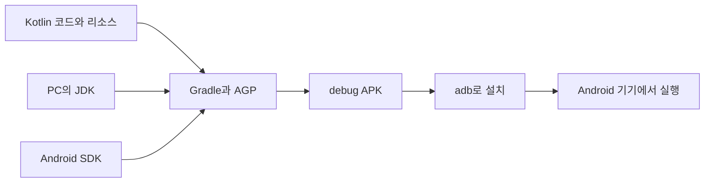
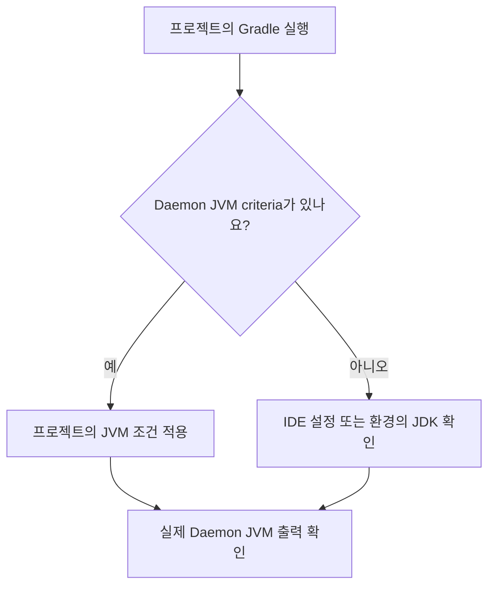
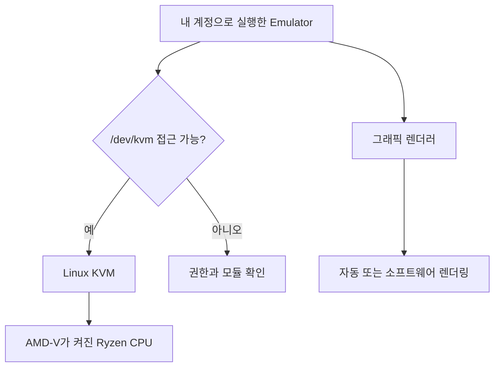
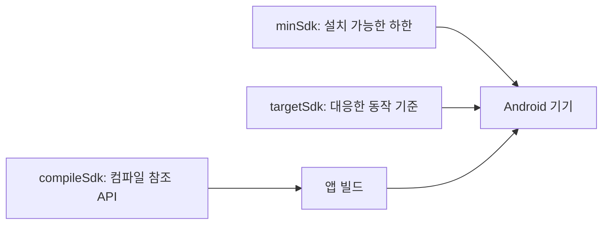
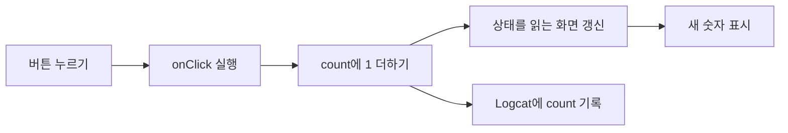
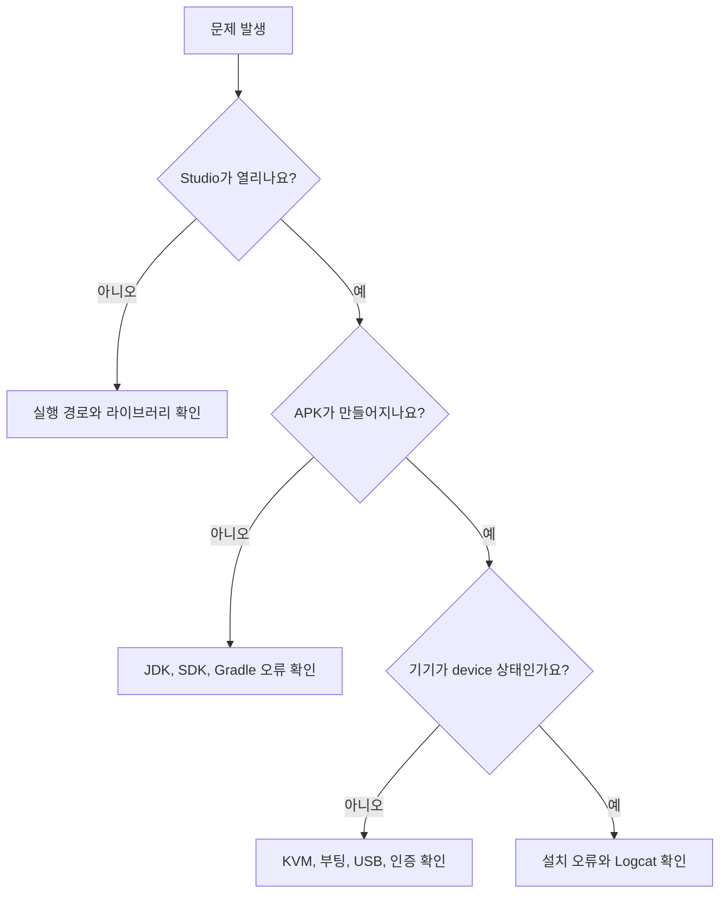

# Fedora 44 KDE에서 Android 앱 개발 시작하기

기준일: 2026-09-08 | 대상: Fedora Linux 44 KDE Plasma Desktop Edition, x86_64, zsh

Kotlin과 Jetpack Compose로 버튼을 누르면 숫자가 올라가는 앱을 만듭니다. 설치부터 실행, 오류 확인, 테스트까지 직접 해봅니다. 각 단계가 끝나면 확인한 결과를 기록하고, 도구가 맡은 일을 자신의 말로 설명해 보세요.

## 00. 이 문서를 읽는 순서

### 이번에 끝낼 작업

개발 도구를 설치하고, 가상 Android 기기를 준비합니다. 첫 앱을 빌드한 뒤 가상 기기에 설치합니다. 실제 휴대전화 연결은 선택 과정입니다. 마지막에는 버튼 동작을 검사하는 테스트와 디버거까지 사용합니다.

학습 경로는 Kotlin, Jetpack Compose, Android SDK입니다. C와 C++ 코드를 함께 쓰는 NDK 과정은 15장에서 설명합니다. Flutter, React Native, 게임 엔진, 앱스토어 출시는 이번 실습 범위에 포함하지 않습니다.

다음 순서로 읽어주세요.

| 구간 | 하는 일 | 끝났다는 증거 |
| --- | --- | --- |
| 01-03장 | 도구의 역할과 PC 상태 확인 | 설치 경로와 관리자 권한의 범위를 설명합니다. |
| 04-06장 | Android Studio, SDK, zsh 설정 | Studio가 열리고 SDK의 adb 경로가 확인됩니다. |
| 07-09장 | KVM, 가상 기기, 프로젝트 준비 | Android 홈 화면이 뜨고 Gradle Sync가 끝납니다. |
| 10-11장 | 앱 작성, 실행, 디버깅, 테스트 | 숫자가 올라가고 UI 테스트가 통과합니다. |
| 12-13장 | 휴대전화 연결과 터미널 빌드 | 선택한 기기에 앱을 설치하고 APK를 찾습니다. |
| 14-18장 | 문제 해결, 유지 관리, 설명 연습, 문서 게시 | 작업 기록을 읽으며 설치 과정을 다시 설명합니다. |

### 기준 PC와 확인 범위

제공된 `Desktop FastFetch Result.txt`에는 다음 환경이 기록돼 있습니다. 공개 문서에는 계정명, 호스트명, 사설 IP를 싣지 않았습니다.

| 항목 | 제공된 기록 | 가이드에 반영한 내용 |
| --- | --- | --- |
| 운영체제 | Fedora 44 KDE, x86_64 | DNF와 Linux용 공식 압축 파일을 사용합니다. |
| 셸 | zsh 5.9 | `~/.zshrc`를 설정합니다. |
| 데스크톱 | KDE Plasma 6.7.4, KWin Wayland | Konsole, Dolphin, Kate 기준으로 안내합니다. |
| CPU | AMD Ryzen 9 7950X | AMD-V와 `kvm_amd`를 확인합니다. |
| GPU | NVIDIA RTX 5060 Ti, AMD 내장 GPU | 에뮬레이터의 그래픽 설정을 따로 점검합니다. |
| 메모리 | 약 62 GiB | 가상 기기 한 대부터 시작합니다. |
| 디스플레이 | 3840x2160, 배율 약 134% | 설치 창이 화면을 벗어날 때의 조치를 담았습니다. |

이 기록으로 BIOS의 SVM 설정, 현재 KVM 권한, NVIDIA 드라이버 상태까지 알 수는 없습니다. 02장과 07장에서 직접 확인합니다. 아래의 성공 출력은 읽는 법을 설명하기 위한 예시입니다.

이 문서는 공식 자료를 조사해 작성했습니다. 작성 환경에서 사용자의 Fedora PC에 접속하거나 Android 앱을 실제 빌드하지는 않았습니다. 메뉴의 작은 배치 차이와 장치별 동작은 각 단계의 확인 절차로 판단하세요.

### 버전은 이렇게 선택합니다

2026-09-08에 확인한 Android Studio 안정판은 Quail 4, `2026.1.4`입니다. Android 17은 API 37에 해당합니다. Android 17 정식 출시 공지는 2026-06-16에 게시됐습니다. [S01] [S02] [S03]

| 항목 | 확인한 기준 | 실습에서의 선택 |
| --- | --- | --- |
| Android Studio | Quail 4, 2026.1.4, Stable | 공식 Linux 압축 파일 |
| Android 플랫폼 | Android 17, API 37 | 정식 SDK Platform 37과 x86_64 시스템 이미지 |
| Android Gradle Plugin | 9.4.0 | 새 프로젝트가 생성한 조합을 먼저 확인 |
| AGP 9.4의 Gradle 요구 버전 | 9.6.0 | 프로젝트의 Gradle Wrapper 사용 |
| AGP 9.4의 JDK 최소 버전 | 17 | Studio에 포함된 JBR부터 확인 |
| AGP 9.4의 기본 Build Tools | 36.0.0 | AGP의 선택을 유지하고 필요한 버전 설치 |

AGP 9.4의 호환표에 적힌 값입니다. JDK 최소 버전, Studio에 포함된 JBR 버전, 앱의 Java 언어 설정은 각각 확인해야 합니다. 같은 숫자로 맞추는 규칙은 없습니다. [S04] [S05]

나중에 이 문서를 읽는다면 [S01]의 Stable 버전과 [S04]의 호환표를 다시 보세요. Canary, Beta, RC, Preview, QPR Beta 표시는 이번 첫 실습에서 선택하지 않습니다. 프로젝트 파일에는 생성 당시의 버전을 기록합니다.

## 01. 코드가 휴대전화 화면에 나타나기까지

### 도구마다 맡은 일이 있습니다

Android Studio는 코드를 쓰고 프로젝트를 관리하는 프로그램입니다. Kotlin은 앱 코드를 작성할 때 쓰는 언어이고, Jetpack Compose는 그 코드로 화면을 구성하는 도구입니다. Android SDK에는 Android 기능을 참조하고 앱을 만드는 데 쓰는 파일과 명령이 들어 있습니다. [S06] [S07]

빌드는 코드를 검사하고 실행할 형태로 바꾼 뒤 리소스와 함께 묶는 과정입니다. Gradle이 작업 순서를 관리합니다. Android Gradle Plugin, 줄여서 AGP는 Gradle에 Android 앱을 만드는 작업을 추가합니다. APK는 기기에 설치하는 앱 파일입니다. [S08] [S09]



그림에서 JDK와 SDK는 빌드 과정에 참여합니다. 완성된 앱은 Android 기기의 런타임에서 실행됩니다. PC에서 Gradle을 실행하는 JVM과 Android 기기의 실행 환경을 구분해 두세요. [S05]

### 이름이 비슷한 도구 읽기

| 이름 | 맡은 일 | 직접 보게 될 위치 |
| --- | --- | --- |
| JDK | Gradle 같은 Java 프로그램을 실행하고 Java 개발 도구 제공 | Studio의 `jbr/` 폴더 |
| JBR | Studio에 포함된 JetBrains의 JDK | `~/.local/opt/android-studio/jbr` |
| SDK Platform | 특정 API 수준의 Android 기능을 컴파일할 때 참조 | `Sdk/platforms/` |
| Build Tools | APK 생성에 쓰는 빌드 도구 묶음 | `Sdk/build-tools/` |
| Platform Tools | adb 등 기기 통신 도구 | `Sdk/platform-tools/` |
| Command-line Tools | sdkmanager 등 SDK 관리 명령 | `Sdk/cmdline-tools/` |
| Emulator | 가상 Android 기기를 실행하는 프로그램 | `Sdk/emulator/` |
| System Image | 가상 기기에 넣을 Android 운영체제 이미지 | `Sdk/system-images/` |
| AVD | 기기 사양, 이미지 선택, 사용자 데이터 등을 묶은 가상 기기 설정 | 보통 `~/.android/avd/` |
| KVM | Linux 커널에서 CPU 가상화를 제공 | `/dev/kvm` |

SDK 도구의 분류와 AVD의 구성은 공식 도구 안내와 Device Manager 문서를 참고했습니다. 경로는 이번 실습에서 사용할 배치입니다. [S07] [S10] [S11]

### 설치 파일을 네 곳으로 나눕니다

| 경로 | 보관할 내용 | 관리 방법 |
| --- | --- | --- |
| `~/.local/opt/android-studio` | IDE와 포함된 JBR | Studio 업데이트 또는 새 압축 파일 |
| `~/Android/Sdk` | SDK와 에뮬레이터 | SDK Manager |
| `~/AndroidStudioProjects` | 직접 만든 소스 코드 | 편집, Git, 별도 백업 |
| `~/.android`, `~/.gradle` | 가상 기기 데이터와 빌드 캐시 등 | 목적을 확인한 뒤 관리 |

`~`는 현재 사용자의 홈 폴더입니다. 폴더 이름 앞의 `.`은 숨김 표시입니다. Dolphin에서는 `Ctrl+H`로 숨김 파일 표시를 바꿉니다. 앱 소스와 자동으로 내려받는 SDK를 분리하면 백업할 대상을 찾기 쉽습니다.

> 설명 연습: Run 버튼을 누른 뒤 화면이 나타날 때까지 어떤 도구가 어떤 순서로 일하는지 말해보세요. 답에 Gradle, APK, adb가 들어가면 좋습니다.

## 02. 터미널을 읽고 PC 상태 확인하기

### 명령을 입력하기 전에

Konsole을 엽니다. 프롬프트는 입력을 기다리는 표시입니다. 문서의 코드 블록에는 프롬프트를 넣지 않았으므로 명령 부분만 복사하면 됩니다. 여러 줄은 위에서부터 한 줄씩 실행하세요.

| 표기 | 읽는 법 |
| --- | --- |
| `명령 옵션 대상` | 프로그램 이름 뒤에 동작 조건과 대상을 적습니다. |
| `$HOME` | 셸이 현재 사용자의 홈 경로로 바꿉니다. |
| `"$HOME/Android/Sdk"` | 경로에 공백이 있어도 한 덩어리로 전달합니다. |
| `sudo` | 해당 명령을 관리자 권한으로 실행합니다. 비밀번호 입력이 화면에 표시되지 않을 수 있습니다. |
| `\|` | 왼쪽 명령의 출력을 오른쪽 명령으로 보냅니다. |
| `>` | 출력을 파일에 씁니다. 같은 이름의 기존 내용은 덮어씁니다. |
| `./` | 현재 폴더 안에 있는 파일을 가리킵니다. |
| `#` | 설정 파일이나 셸 코드에서 주석을 시작합니다. |

한 명령이 오류로 끝나면 그 줄에서 멈춥니다. 바로 뒤의 설치나 파일 이동을 이어서 실행하지 마세요. `Ctrl+C`는 진행 중인 명령을 중단할 때 씁니다. 패키지를 설치하는 도중에는 가능하면 종료를 기다립니다.

### 운영체제, 셸, 저장 공간 확인

다음 명령은 상태를 읽습니다. 파일을 수정하지 않습니다.

```bash
cat /etc/fedora-release
uname -m
ps -p $$ -o comm=
printf '%s\n' "$XDG_SESSION_TYPE"
df -h "$HOME"
free -h
```

`cat`은 파일 내용을 표시합니다. 첫 줄에서 Fedora 44를 확인하세요. `uname -m`은 CPU 계열을 보여주며 이 가이드의 대상은 `x86_64`입니다.

`ps`는 실행 중인 프로세스를 조회합니다. `$$`는 현재 셸의 프로세스 번호이고, `-p`는 그 번호를 선택합니다. `-o comm=`은 프로그램 이름만 표시합니다. 결과가 `zsh`인지 봅니다. `$SHELL`에는 로그인 셸 정보가 들어 있어 현재 실행 중인 셸과 다를 때도 있습니다.

`printf`는 지정한 형식으로 값을 출력합니다. `%s`는 문자열이고 `\n`은 줄바꿈입니다. `wayland`가 나오면 현재 로그인 세션이 Wayland입니다. 개별 앱이 XWayland를 사용하는지는 이 값만으로 판단하지 않습니다.

`df`는 파일시스템의 사용량을, `free`는 메모리 상태를 보여줍니다. `-h`는 사람이 읽기 쉬운 단위로 표시하는 옵션입니다. `df`의 `Avail` 열을 확인하세요.

실습용으로 홈 폴더가 있는 파일시스템에 40 GiB 이상 여유를 두는 계획을 권합니다. 이 값은 가상 기기 이미지, 다운로드, 빌드 캐시까지 고려한 가이드의 여유분입니다. Google의 Linux 권장 저장 공간은 32 GB 이상이며 Studio와 Emulator의 최소 메모리는 16 GB입니다. [S02]

### 이번 실습에서 지킬 권한 범위

DNF 패키지 설치와 시스템 장치 설정에만 `sudo`를 사용합니다. Android Studio, SDK Manager, adb, Gradle은 자신의 계정으로 실행합니다. 홈 폴더의 개발 파일이 관리자 소유가 되면 이후 업데이트와 빌드가 막힐 수 있습니다.

SELinux와 방화벽은 켜 둡니다. 인터넷에서 받은 설치 스크립트를 읽지 않고 관리자 권한으로 실행하지 마세요. 실제 휴대전화 연결에서도 부트로더 잠금 해제와 루팅은 이 실습에 필요하지 않습니다. 개발자 옵션의 USB debugging을 사용합니다. [S12]

> 기록: 운영체제, CPU 계열, 현재 셸, 세션 종류, 홈 폴더의 남은 공간을 적으세요. 제공된 FastFetch 기록과 현재 상태가 달라졌다면 현재 결과를 사용합니다.

## 03. Fedora 패키지 준비하기

### 운영체제 업데이트

작업 중인 파일을 저장한 뒤 실행합니다.

```bash
sudo dnf upgrade --refresh
```

`dnf`는 Fedora의 패키지 관리자입니다. `upgrade`는 설치된 패키지를 업데이트하고, `--refresh`는 저장소 정보를 새로 확인합니다. 설치 목록과 다운로드 용량을 읽은 뒤 진행 여부를 선택하세요. 의도하지 않은 대규모 제거가 보이면 `n`으로 중단합니다. [S13]

커널이나 그래픽 드라이버가 업데이트됐다면 패키지 작업이 끝난 뒤 KDE 메뉴에서 재시작합니다. 새 커널과 사용자 프로그램을 같은 시점의 상태로 맞춘 다음 에뮬레이터를 점검하려는 과정입니다. NVIDIA 드라이버의 설치 방식을 이 문서에서 변경하지 않습니다.

### 기본 도구 설치

```bash
sudo dnf install git unzip zip tar gzip usbutils acl file
```

이번 문서에서 직접 쓰거나 다운로드 파일을 다룰 때 쓰는 도구들입니다. 이미 설치된 패키지는 DNF가 확인합니다. [S14]

| 패키지 | 준비하는 이유 |
| --- | --- |
| `git` | 소스의 변경 기록을 관리합니다. |
| `unzip`, `zip` | ZIP 파일을 풀거나 만듭니다. |
| `tar`, `gzip` | Studio의 `.tar.gz` 파일을 풉니다. |
| `usbutils` | `lsusb`로 USB 기기를 확인합니다. |
| `acl` | `getfacl`로 장치의 추가 접근 권한을 읽습니다. |
| `file` | 실행 파일의 종류와 아키텍처를 읽습니다. |

### 공식 문서의 32비트 호환 라이브러리

Google의 Linux 설치 안내에는 Fedora용 32비트 라이브러리가 여전히 적혀 있습니다. Fedora 44에는 zlib 호환 기능을 제공하는 `zlib-ng-compat` 패키지가 있습니다. 아래에서 자신의 저장소에 i686 패키지가 있는지 먼저 조회합니다. [S02] [S15]

```bash
dnf info zlib-ng-compat.i686 ncurses-libs.i686 bzip2-libs.i686
```

`info`는 패키지 정보를 보여주며 설치하지 않습니다. `.i686`은 32비트 x86용 패키지라는 뜻입니다. 세 패키지가 모두 조회되면 공식 설치 안내의 호환 라이브러리를 다음과 같이 준비합니다.

```bash
sudo dnf install zlib-ng-compat.i686 ncurses-libs.i686 bzip2-libs.i686
```

`zlib-ng-compat`와 `bzip2-libs`는 압축 형식 처리에 쓰이는 라이브러리입니다. `ncurses-libs`는 터미널 화면 처리 기능을 제공합니다. 64비트 PC에서 32비트 프로그램을 실행할 때 해당 아키텍처의 라이브러리를 요구할 수 있습니다.

패키지를 찾지 못하면 오류를 기록하세요. 다른 Fedora 릴리스의 RPM이나 출처가 불분명한 저장소를 섞지 않습니다. 이 경우 04장의 Studio 실행을 먼저 확인하고, 실제로 나타난 라이브러리 오류를 14장에서 진단합니다. 모든 최신 바이너리가 이 세 라이브러리를 호출하는지는 이 문서에서 실행 검증하지 않았습니다.

### 이번에는 별도 설치하지 않는 도구

Java, Kotlin 컴파일러, Gradle의 시스템 패키지는 이번 경로에서 따로 설치하지 않습니다. Studio에는 JBR이 들어 있고, 프로젝트에는 Gradle Wrapper가 생성됩니다. AGP 9 계열은 Kotlin 지원을 포함합니다. Docker, Podman, virt-manager, libvirt를 이 실습 때문에 추가할 계획도 없습니다. Linux Emulator는 KVM 접근을 직접 확인합니다. [S05] [S16] [S17] [S11]

> 확인: DNF 작업이 오류 없이 끝났는지 봅니다. 설명 연습: 운영체제 패키지는 DNF로, Android SDK 패키지는 SDK Manager로 관리하는 이유를 폴더 위치와 함께 설명해보세요.

## 04. Android Studio 설치하기

### 공식 파일 내려받기

[S01]의 Android Studio 다운로드 페이지를 엽니다. Stable 채널의 Linux 64-bit `.tar.gz` 파일을 고릅니다. 약관을 읽고 동의하면 다운로드를 진행하세요. 문서 작성 시 파일 이름은 `android-studio-quail4-linux.tar.gz`입니다.

압축 파일은 프로그램 폴더 전체를 묶은 파일입니다. 이번 설치 위치는 `~/.local/opt`입니다. 자신의 홈 폴더에 두므로 IDE 업데이트 때 관리자 권한을 요구하지 않는 배치입니다.

Dolphin에서 내려받은 파일이 있는 폴더를 엽니다. 빈 곳을 오른쪽 클릭해 터미널 열기를 선택하거나 `F4`로 터미널 패널을 엽니다. 다운로드 폴더 이름을 추측할 필요가 없습니다. 다음 명령으로 파일이 보이는지 확인하세요.

```bash
pwd
ls -lh android-studio-quail4-linux.tar.gz
```

`pwd`는 현재 폴더를 표시합니다. `ls -lh`는 파일 이름, 크기, 권한 등을 읽기 쉬운 형태로 보여줍니다. 파일이 없다면 Dolphin에서 실제 파일 이름을 확인하고 명령의 이름도 바꿉니다. 새 버전을 받았다면 이후 두 명령에도 같은 실제 파일 이름을 사용하세요.

### 다운로드가 온전한지 확인

```bash
sha256sum android-studio-quail4-linux.tar.gz
```

출력 앞부분은 파일 내용을 계산한 SHA-256 값입니다. 다운로드 페이지의 Linux 행에 있는 `SHA-256 checksum`과 64자리 전체를 비교합니다. 한 글자라도 다르면 압축을 풀지 말고 다운로드를 다시 확인하세요. 기준 값은 같은 파일을 제공한 공식 HTTPS 페이지에서 가져옵니다. [S01]

체크섬은 받은 파일과 기준 파일의 내용이 같은지 확인하는 데 씁니다. 이 문서에 오래된 체크섬을 고정하지 않았습니다. 다운로드 파일이 업데이트되면 값도 바뀝니다.

### 압축 풀기

먼저 설치 위치와 기존 설치를 확인합니다.

```bash
mkdir -p "$HOME/.local/opt"
ls -ld "$HOME/.local/opt/android-studio"
```

`mkdir -p`는 필요한 상위 폴더까지 만듭니다. 이미 있는 폴더는 유지합니다. 두 번째 줄에서 `No such file or directory`가 나오면 아직 해당 위치에 Studio가 없는 상태입니다.

기존 `android-studio` 폴더가 있으면 새 파일을 겹쳐 풀지 않습니다. 기존 Studio를 종료하고 폴더의 용도를 확인하세요. 기존 설치를 계속 쓸 때는 15장의 업데이트 경로를 따릅니다. 아래는 새 설치에 사용합니다.

```bash
tar -xzf android-studio-quail4-linux.tar.gz -C "$HOME/.local/opt"
ls "$HOME/.local/opt/android-studio/bin"
```

`tar`의 `-x`는 풀기, `-z`는 gzip 처리, `-f`는 입력 파일 지정입니다. `-C`는 결과를 놓을 폴더를 정합니다. 압축 안의 `android-studio` 폴더가 그 아래에 생깁니다. 마지막 명령으로 실행 파일 목록을 확인합니다.

### 처음 실행하고 KDE 메뉴에 등록

현재 공식 안내는 `bin/studio` 실행 파일을 사용합니다. 목록에 `studio`가 있으면 아래 명령을 실행하세요. [S02]

```bash
"$HOME/.local/opt/android-studio/bin/studio"
```

예전 배포 파일에서 `studio.sh`만 보인다면 실제 파일 이름에 맞춰 `bin/studio.sh`를 실행합니다. 명령이 프로그램을 실행하는 동안 터미널이 입력을 기다리지 않을 수 있습니다. 첫 설정을 마칠 때까지 터미널도 열어 두세요.

Studio에서 `Tools > Create Desktop Entry`를 찾아 등록합니다. 프로젝트가 아직 없으면 먼저 05장을 마친 뒤 메뉴를 확인하세요. 메뉴 검색인 `Find Action`에서 `Create Desktop Entry`를 찾아도 됩니다. 전체 사용자용 항목이 있으면 선택을 해제하고 자신의 계정용으로 등록합니다. [S02]

Studio를 종료하고 KDE 애플리케이션 메뉴에서 다시 실행합니다. 이렇게 실행돼야 설치 폴더와 메뉴 항목의 연결도 확인한 셈입니다. 메뉴가 아직 갱신되지 않았다면 직접 실행 경로로 작업을 계속하고 다음 로그인 뒤 다시 확인합니다.

> 확인: `~/.local/opt/android-studio`에 `bin`과 `jbr`가 있고 Studio 환영 화면이 열립니다. 설명 연습: 다운로드한 압축 파일, 설치 폴더, KDE 메뉴 항목이 각각 무엇을 담고 있나요?

## 05. 첫 실행과 Android SDK 설치

### Setup Wizard 통과하기

기존 설정을 가져올지 묻는 화면에서는 새 설치이므로 가져오지 않는 항목을 고릅니다. 사용 통계 전송은 원하는 대로 선택하세요. Google 계정 로그인과 AI 도구 연결은 이번 실습의 필수 절차에 포함하지 않습니다.

설치 유형에 `Standard`가 있으면 먼저 사용합니다. SDK 위치 선택 화면이 나오면 `~/Android/Sdk`에 해당하는 실제 홈 경로를 확인합니다. 이미 같은 위치에 SDK가 있으면 기존 패키지가 무엇인지 확인하고 재사용하세요. [S02]

약관 화면에는 라이선스가 여러 개 나올 수 있습니다. 왼쪽 목록의 각 항목을 읽고 동의하는 항목을 선택합니다. `Finish`가 비활성 상태라면 아직 처리하지 않은 항목이 있는지 봅니다. 다운로드가 끝나면 `Finish`로 닫습니다.

### Accept 버튼이 화면 밖으로 나갔다면

창 제목 표시줄을 두 번 눌러 최대화를 시도합니다. `Tab`은 다음 입력 요소로, `Shift+Tab`은 이전 요소로 이동합니다. 초점 표시가 동의 항목에 놓였는지 확인한 뒤 `Space`로 선택하세요.

화면이 계속 잘리면 KDE 시스템 설정의 디스플레이 배율을 기록한 뒤 일시적으로 낮춥니다. 설치를 마치면 원래 배율로 돌립니다. 글이 잘리지 않는 상태에서 약관을 읽으세요. 보이지 않는 버튼을 추측해서 누르거나 약관을 자동 승인하는 스크립트를 쓰지 않습니다.

### SDK Manager에서 구성을 확인

환영 화면의 `More Actions > SDK Manager` 또는 프로젝트를 연 뒤 `Tools > SDK Manager`로 들어갑니다. 경로가 달라졌다면 `Find Action`에서 `SDK Manager`를 검색합니다.

상단 `Android SDK Location`이 실제 SDK 위치입니다. 이 문서에서는 `~/Android/Sdk`를 사용합니다. 다른 위치를 골랐다면 06장의 `ANDROID_HOME`도 같은 위치로 맞추세요.

| 화면 | 선택할 항목 | 용도 |
| --- | --- | --- |
| SDK Platforms | Android 17의 정식 Android SDK Platform, API 37 | Android 17 API를 참조해 컴파일 |
| SDK Tools | Android SDK Platform-Tools | adb 제공 |
| SDK Tools | Android SDK Build-Tools | APK 생성 도구 제공 |
| SDK Tools | Android Emulator | 가상 기기 실행 |
| SDK Tools | Android SDK Command-line Tools (latest) | sdkmanager 제공 |

[S07] [S18]

`Apply`를 눌러 변경 목록을 보고 설치합니다. NDK, CMake, Windows용 USB Driver, Windows용 Emulator Hypervisor Driver는 이번 단계에서 선택하지 않습니다.

Build Tools는 SDK Platform과 버전 번호를 항상 맞출 필요가 없습니다. AGP 9.4의 기본 Build Tools는 `36.0.0`입니다. SDK Manager의 최신 Build Tools를 설치한 상태에서도 프로젝트가 기본 버전을 추가로 요구할 수 있습니다. 빌드 메시지를 보고 필요한 버전을 설치하고 `buildToolsVersion`을 임의로 고정하지 않습니다. [S04]

SDK Manager에서 Preview라는 글자가 보이면 항목의 전체 이름과 API 수준을 확인하세요. 일부 공식 SDK 설정 페이지에도 예전 Preview 표기가 남아 있습니다. 이 실습은 정식 Android 17의 API 37을 사용합니다. 정식 항목을 찾기 어렵다면 SDK 목록을 새로고침하고 설치된 Studio 버전부터 확인합니다. [S03] [S19]

### SDK 설치 확인

```bash
ls "$HOME/Android/Sdk"
"$HOME/Android/Sdk/platform-tools/adb" version
"$HOME/Android/Sdk/emulator/emulator" -version
```

첫 줄에서 `platform-tools`, `platforms`, `build-tools`, `emulator`, `cmdline-tools` 폴더를 찾습니다. 뒤의 두 명령은 각 프로그램의 버전을 표시합니다. 설치된 도구의 정보를 읽는 조회 명령입니다.

아직 `adb`라는 짧은 이름으로 실행하지 않았습니다. 지금은 전체 경로를 지정해서 어느 파일을 실행했는지 확인합니다. 다음 장에서 경로 검색 규칙을 설정합니다.

> 설명 연습: SDK Platform만 설치한 상태에서 adb가 없다면 SDK Manager의 어느 항목을 확인해야 할까요?

## 06. zsh에서 SDK 도구 찾기와 JDK 확인

### PATH가 하는 일

터미널에 `adb`를 입력하면 셸은 `PATH`에 나열된 폴더를 앞에서부터 찾습니다. SDK의 `platform-tools`를 여기에 넣으면 긴 파일 경로를 매번 적지 않아도 됩니다. `ANDROID_HOME`은 SDK의 루트 위치를 알려주는 환경 변수입니다. [S20]

zsh는 대화형 셸을 열 때 보통 `~/.zshrc`를 읽습니다. `ZDOTDIR`를 따로 지정한 환경에서는 그 위치의 `.zshrc`를 사용합니다. [S21]

다음 줄로 설정 파일 위치를 확인합니다.

```bash
printf '%s\n' "${ZDOTDIR:-$HOME}/.zshrc"
```

`${ZDOTDIR:-$HOME}`은 `ZDOTDIR` 값이 없으면 `$HOME`을 사용한다는 뜻입니다. 출력된 파일을 Kate로 엽니다. 파일이 이미 있으면 수정 전 복사본을 만들어 보관하세요.

일반적인 위치인 `~/.zshrc`를 사용한다면 다음처럼 엽니다.

```bash
kate "$HOME/.zshrc"
```

파일이 없어도 Kate에서 새로 작성해 저장할 수 있습니다. 다른 경로가 출력됐다면 그 파일을 여세요. 기존 내용을 지우지 말고 아래 블록을 한 번만 덧붙입니다.

```zsh
# Android SDK
export ANDROID_HOME="$HOME/Android/Sdk"
typeset -U path
path=("$ANDROID_HOME/platform-tools" "$ANDROID_HOME/emulator" "$ANDROID_HOME/cmdline-tools/latest/bin" "${path[@]}")
export PATH
```

| 줄 | 의미 |
| --- | --- |
| `export ANDROID_HOME=...` | SDK 루트 경로를 자식 프로그램에도 전달합니다. |
| `typeset -U path` | zsh의 경로 배열에서 중복 항목을 정리합니다. |
| `path=(...)` | SDK 도구 폴더를 앞에 넣고 기존 경로를 뒤에 유지합니다. |
| `"${path[@]}"` | 기존 배열의 각 경로를 그대로 이어 붙입니다. |
| `export PATH` | 자식 프로그램이 사용할 검색 경로를 내보냅니다. |

zsh의 `path` 배열과 `PATH` 문자열은 연결돼 있습니다. 이 블록은 zsh용입니다. `.bashrc`에는 그대로 넣지 않습니다. `ANDROID_SDK_ROOT`는 공식 문서에서 사용 중단된 변수로 안내하므로 새로 추가하지 않습니다. [S20] [S22]

저장 후 새 Konsole 탭을 열어 확인합니다.

```bash
printf '%s\n' "$ANDROID_HOME"
command -v adb
adb version
command -v sdkmanager
```

`command -v`는 어떤 파일이 실행될지 보여줍니다. `adb` 경로가 `.../Android/Sdk/platform-tools/adb`인지 확인하세요. `/usr/bin/adb`가 먼저 나오면 SDK 경로 설정을 다시 읽습니다. Fedora의 `android-tools`에도 adb가 들어 있으므로 둘이 함께 설치돼 있을 때는 경로 순서가 중요합니다. [S23]

### Studio와 Gradle의 Java 선택 확인

Studio에 포함된 JBR의 버전을 읽습니다.

```bash
"$HOME/.local/opt/android-studio/jbr/bin/java" -version
```

프로젝트를 만든 뒤 `Settings > Build, Execution, Deployment > Build Tools > Gradle`에서 Gradle JDK를 확인합니다. 항목이 있으면 Studio의 JBR 또는 해당 경로를 선택합니다. `GRADLE_LOCAL_JAVA_HOME`을 사용하는 프로젝트라면 그 값이 어느 JDK 경로로 해석되는지 확인하세요. [S05]

이 가이드에서는 다른 Java 프로젝트에 미칠 영향을 줄이기 위해 `.zshrc`의 `JAVA_HOME`을 전역으로 바꾸지 않습니다. 13장에서는 Gradle 명령 한 번에만 JBR 경로를 전달합니다.

프로젝트에 `gradle/gradle-daemon-jvm.properties`가 있으면 내용을 읽으세요. Gradle의 Daemon JVM criteria가 지정돼 있으면 실제 빌드를 수행하는 JVM 선택에서 `JAVA_HOME`보다 먼저 적용됩니다. 필요한 JDK를 자동으로 받을 수 있도록 설정된 프로젝트도 있습니다. [S24]



그림은 JDK를 확인할 때의 순서입니다. 별도 Gradle 속성까지 포함한 우선순위는 [S24]에서 확인합니다.

기록할 값은 Studio의 Runtime, Gradle의 Launcher JVM, Gradle의 Daemon JVM입니다. `./gradlew --version`의 출력을 13장에서 확인합니다. 셋의 실제 역할을 구분하고 프로젝트 요구 버전이 충족되는지 봅니다.

> 확인: 새 Konsole에서도 SDK의 adb가 실행됩니다. 설명 연습: `JAVA_HOME`을 바꿨는데 Gradle Daemon JVM이 그대로라면 어떤 프로젝트 파일을 확인하나요?

## 07. AMD CPU에서 KVM 준비하기

### CPU 가상화와 화면 그리기

KVM은 Linux 커널의 가상화 기능입니다. Emulator는 `/dev/kvm`을 통해 이 기능을 사용합니다. CPU와 가상 기기 이미지의 계열이 맞으면 Android 코드를 효율적으로 실행할 수 있습니다. Ryzen PC에는 x86_64 이미지를 선택합니다. [S11] [S25]

화면을 그리는 그래픽 설정은 별도로 확인합니다. NVIDIA 관련 그래픽 오류가 생겨도 먼저 KVM 검사 결과와 그래픽 오류를 각각 기록하세요.



### CPU 기능과 장치 확인

```bash
grep -m1 -o svm /proc/cpuinfo
ls -l /dev/kvm
lsmod | grep kvm
```

첫 줄의 `grep`은 CPU 정보에서 `svm`이라는 글자를 찾습니다. `-m1`은 처음 일치한 줄까지만 보고, `-o`는 일치한 부분만 출력합니다. `svm`이 보이면 AMD 가상화 기능이 운영체제에 노출돼 있습니다.

`ls -l`은 `/dev/kvm`의 소유자와 접근 권한을 보여줍니다. `lsmod`는 로드된 커널 모듈 목록입니다. `| grep kvm`으로 KVM 관련 줄만 남깁니다. `kvm_amd`와 `kvm`을 찾으세요.

`svm`이 없으면 재시작해 UEFI 또는 BIOS의 `SVM Mode`나 CPU 가상화 설정을 확인합니다. 메뉴 위치는 보드와 펌웨어 버전에 따라 달라집니다. 현재 값을 기록하고 SVM 항목만 변경하세요. Secure Boot나 IOMMU 설정을 이 실습 때문에 임의로 바꾸지 않습니다.

SVM이 보이는데 KVM 장치와 모듈이 없다면 한 번 로드를 시도합니다.

```bash
sudo modprobe kvm_amd
```

`modprobe`는 커널 모듈을 로드합니다. 실패하면 메시지를 기록하고 여기서 멈춥니다. `Module not found`는 실행 중인 커널과 설치된 모듈 상태를, 가상화 비활성 메시지는 BIOS 설정을 확인할 단서입니다.

### 내 계정에서 사용할 수 있는지 검사

```bash
"$ANDROID_HOME/emulator/emulator" -accel-check
```

성공 출력에는 보통 `accel`, `0`, `KVM ... is installed and usable`이 포함됩니다. 버전 숫자는 달라질 수 있습니다. 이 결과가 이번 단계의 핵심 확인입니다. [S11]

이미 사용할 수 있다면 그룹이나 udev 규칙을 추가하지 않습니다. 권한 오류가 났을 때만 다음을 조회합니다.

```bash
id -nG
getfacl /dev/kvm
```

`id -nG`는 현재 세션의 그룹 이름을 나열합니다. `getfacl`은 기본 권한과 사용자별 추가 권한을 보여줍니다. `user:내계정:rw-` 같은 항목이 있으면 해당 계정에 읽기와 쓰기가 부여된 상태입니다.

`/dev/kvm`이 `root:kvm` 소유이고, `kvm` 그룹에는 읽기와 쓰기가 있지만 내 계정에는 접근이 없다고 확인됐을 때만 아래를 실행합니다.

```bash
sudo usermod -aG kvm "$USER"
```

`usermod`는 계정 설정을 바꿉니다. `-G kvm`은 추가할 보조 그룹이고 `-a`는 기존 그룹을 유지하며 추가한다는 뜻입니다. `-a`를 빼지 마세요.

KDE에서 완전히 로그아웃한 뒤 다시 로그인합니다. Studio도 새 세션에서 실행하고 `id -nG`와 `-accel-check`를 다시 확인합니다. 터미널만 새로 열면 기존 데스크톱 세션의 그룹 상태가 남을 수 있습니다.

이 조건과 실제 소유자 또는 권한이 다르면 위 명령을 추측해서 적용하지 않습니다. 시스템의 udev 규칙과 ACL을 확인합니다. systemd의 KVM 접근 규칙은 빌드 설정에 따라 달라질 수 있으므로 모든 Fedora 설치에 같은 권한을 가정하지 않았습니다. [S26]

> 통과 조건: 자신의 계정으로 실행한 `-accel-check`가 KVM 사용 가능을 보고합니다. `chmod 777 /dev/kvm`이나 Studio의 관리자 실행으로 우회하지 않습니다.

## 08. 가상 Android 기기 만들기

### 기기 사양과 운영체제 이미지 선택

Studio의 `Tools > Device Manager`를 엽니다. 환영 화면에서는 `More Actions > Virtual Device Manager`라는 이름으로 보일 수 있습니다. `Create Device` 또는 기기 추가 버튼을 누릅니다. [S10]

Phone 항목에서 일반적인 중간 크기 휴대전화 프로필을 고릅니다. 목록에 있으면 `Medium Phone`을 사용해도 좋습니다. 프로필은 화면 크기와 하드웨어 사양을 정합니다.

다음 화면에서 정식 Android 17, API 37의 `x86_64` 이미지를 선택합니다. API, 이미지 이름, ABI를 각각 확인하세요. Google Play 테스트가 필요한 경우에는 Play Store가 포함된 이미지를 선택할 수 있습니다. 이번 카운터 앱은 Google APIs 이미지로 진행합니다. [S10] [S11]

`Google APIs`는 Google 관련 API 사용을 위한 구성입니다. `Google Play` 이미지는 Play Store가 포함된 구성이며 선택 가능한 하드웨어 프로필에도 제약이 있습니다. 목록에 두 종류가 모두 보인다고 두 이미지를 받을 필요는 없습니다. [S10]

다운로드 후 AVD 이름을 `FedoraLab_API37`로 지정합니다. 14장의 터미널 예제가 이 이름을 사용합니다. Graphics는 `Automatic` 또는 `Auto`로 시작합니다. 메모리와 CPU 코어 수는 기본값을 유지하세요. 필요할 때 측정하며 바꿉니다.

### 부팅하고 연결 확인

Device Manager에서 만든 기기의 실행 버튼을 누릅니다. 첫 부팅은 이미지의 초기 설정과 사용자 데이터 생성이 함께 진행됩니다. Android 홈 화면이 나타날 때까지 기다린 뒤 잠금 화면이 있으면 해제합니다.

Konsole에서 다음 명령을 실행합니다.

```bash
adb devices -l
```

예시 출력입니다.

```text
List of devices attached
emulator-5554  device  product:... model:... transport_id:1
```

`emulator-5554`는 연결된 기기의 식별자입니다. 뒤의 `device`는 adb가 통신할 수 있는 상태를 뜻합니다. 운영체제 부팅이 완전히 끝났는지는 홈 화면까지 확인합니다. `offline`이면 아직 연결 준비가 끝나지 않았거나 통신 문제가 있는 상태입니다. [S27]

### 껐다 켤 때 알아둘 동작

AVD의 Quick Boot는 저장한 상태로 빠르게 다시 시작합니다. 부팅 문제가 있으면 Device Manager에서 `Cold Boot`를 시도합니다. 저장된 실행 상태를 사용하지 않고 부팅합니다. [S28]

`Wipe Data`는 가상 기기의 앱과 사용자 데이터를 지웁니다. 필요한 데이터가 없는지 확인한 뒤 마지막 수단으로 사용하세요. NDK의 ABI 테스트를 위해 다른 이미지를 추가할 때도 기존 기기를 바로 삭제하지 않습니다.

그래픽이 깨지거나 검은 화면이 계속되면 14장의 그래픽 절차로 이동합니다. KVM 검사가 성공했다면 그 결과도 함께 기록하세요.

> 확인: 홈 화면이 보이고 `adb devices -l`에 `device`가 표시됩니다. 설명 연습: Emulator를 설치한 뒤에도 System Image와 AVD가 필요한 이유는 무엇인가요?

## 09. 첫 프로젝트 만들고 설정 읽기

### Empty Activity 생성

환영 화면에서 `New Project`를 누릅니다. 프로젝트가 열려 있으면 `File > New > New Project`로 들어갑니다. `Phone and Tablet`의 `Empty Activity`를 선택하세요. Compose 지원 템플릿을 사용합니다. [S06]

| 입력 항목 | 실습값 | 의미 |
| --- | --- | --- |
| Name | `FedoraHello` | 프로젝트의 이름 |
| Package name | `com.example.fedorahello` | 코드와 앱 식별에 사용할 이름의 출발값 |
| Save location | `~/AndroidStudioProjects/FedoraHello`에 해당하는 실제 경로 | 소스 파일을 저장할 폴더 |
| Language | Kotlin | 앱 코드를 작성할 언어 |
| Minimum SDK | API 26 | 실습에서 정한 설치 가능한 최소 Android 수준 |
| Build configuration language | Kotlin DSL, 선택 항목이 있을 때 | Gradle 설정 파일의 문법 |

API 26은 이 가이드의 학습용 선택입니다. 새 템플릿이 더 높은 최소값을 요구하면 그 값을 유지하고 기록합니다. 실제 휴대전화에서 실행하려면 그 기기의 API 수준이 프로젝트의 `minSdk` 이상이어야 합니다. [S29]

`Finish`를 누르면 파일이 생성되고 Gradle Sync가 시작됩니다. Sync는 빌드 설정을 읽고 플러그인과 라이브러리를 내려받아 IDE의 프로젝트 이해를 맞추는 과정입니다. 첫 실행에는 인터넷이 필요합니다. [S08]

하단 작업 표시가 끝나고 Gradle 관련 오류가 없는지 확인하세요. 오류가 있다면 파일 편집을 시작하기 전에 원인을 읽습니다. 첫 프로젝트에서 자동으로 제안하는 버전 업그레이드는 보류하고 생성된 조합으로 먼저 실행합니다.

### Android API 숫자 세 개 읽기

`app/build.gradle.kts`에서 `compileSdk`, `minSdk`, `targetSdk`를 찾습니다. 템플릿에 따라 표현 방식은 달라질 수 있습니다.

| 항목 | 결정하는 내용 | 이번 실습 |
| --- | --- | --- |
| `compileSdk` | 컴파일할 때 참조할 Android API | API 37 기준으로 확인 |
| `minSdk` | 앱을 설치할 수 있는 최소 API | API 26 또는 템플릿이 요구한 값 |
| `targetSdk` | 앱이 대응한다고 선언한 Android 동작 기준 | 새 실습 앱은 API 37 기준으로 확인 |

`compileSdk`를 높이면 최신 API를 코드에서 참조할 준비가 됩니다. 오래된 기기에서 해당 API를 실행할 때는 버전 확인과 대응 코드가 필요합니다. `minSdk`가 설치 하한을 정합니다. `targetSdk`는 운영체제가 앱에 적용할 동작 변화에 관여합니다. [S19] [S29]



API 37 SDK를 설치했어도 템플릿이 다른 정식 API를 생성할 수 있습니다. 먼저 그 조합으로 빌드 상태를 확인하세요. 이 문서의 API 37 실습값으로 바꿀 때는 프로젝트가 사용하는 AGP의 지원 범위를 확인하고 SDK Upgrade Assistant의 안내를 읽습니다. `compileSdk`와 `targetSdk`를 바꾼 뒤 Sync를 다시 실행합니다. [S04] [S19]

### 프로젝트 파일의 역할

왼쪽 파일 창이 `Android` 보기라면 `Project` 보기로 바꾸면 실제 폴더 구조를 읽기 쉽습니다. 다음 목록은 템플릿에 따라 일부 파일이 추가될 수 있습니다.

```text
FedoraHello/
  app/
    build.gradle.kts
    src/
      main/
        AndroidManifest.xml
        java/com/example/fedorahello/MainActivity.kt
        res/
      test/
      androidTest/
  gradle/
    libs.versions.toml
    wrapper/gradle-wrapper.properties
  build.gradle.kts
  settings.gradle.kts
  gradlew
  local.properties
```

| 파일 또는 폴더 | 읽을 내용 |
| --- | --- |
| `MainActivity.kt` | 첫 화면을 여는 Kotlin 코드 |
| `res/` | 문자열, 아이콘, 테마 등 앱 리소스 |
| `AndroidManifest.xml` | 앱의 구성 요소와 권한 선언 |
| `app/build.gradle.kts` | app 모듈의 Android 설정과 의존성 |
| `libs.versions.toml` | 라이브러리와 플러그인의 버전 및 별칭 |
| `settings.gradle.kts` | 프로젝트에 포함할 모듈과 저장소 |
| `gradle-wrapper.properties` | 프로젝트가 사용할 Gradle 배포본 |
| `gradlew` | 그 Gradle을 준비하고 실행하는 Wrapper |
| `local.properties` | 이 PC의 SDK 경로 같은 로컬 설정 |

[S08] [S17]

`package`는 Kotlin 코드의 이름 공간입니다. `applicationId`는 설치된 앱을 식별합니다. `namespace`는 생성되는 Android 코드의 이름 공간에 쓰입니다. 첫 템플릿에서는 값이 같을 수 있습니다. 각각의 용도를 확인하고 이번 실습에서는 생성된 값을 유지합니다. [S08]

### 오래된 Kotlin 플러그인 예제 주의

AGP 9.0 이상은 Kotlin 지원을 기본으로 포함합니다. 예전 글에서 가져온 `org.jetbrains.kotlin.android` 또는 `kotlin-android` 플러그인을 새 프로젝트에 덧붙이면 충돌할 수 있습니다. Compose compiler 플러그인의 설정은 용도가 따로 있으므로 템플릿의 `org.jetbrains.kotlin.plugin.compose` 설정을 유지합니다. [S16] [S30]

> 확인: 프로젝트 Sync가 끝났고 Gradle, AGP, SDK 숫자를 파일에서 찾았습니다. 설명 연습: Android 17 SDK로 만든 앱의 `minSdk`가 26이라면 설치 가능한 기기를 어떤 값으로 판단하나요?

## 10. 버튼을 누르면 숫자가 올라가는 앱

### 먼저 기본 앱 실행

상단 실행 구성에서 `app`을, 대상 기기에서 `FedoraLab_API37`을 선택합니다. `Run` 버튼을 누르세요. 빌드와 설치가 끝난 뒤 템플릿의 화면이 보이면 처음 상태를 기록합니다. [S09]

이 확인은 수정 전의 기준입니다. 이제 화면을 바꾸다가 문제가 생기면 설치 문제와 코드 변경을 나눠 살펴볼 단서가 생깁니다.

### MainActivity.kt 바꾸기

`app/src/main/java/com/example/fedorahello/MainActivity.kt`를 엽니다. 파일 창에서 패키지가 한 줄로 합쳐 보일 수 있습니다. 생성된 파일을 열어 전체 내용을 아래 코드로 바꿉니다.

프로젝트를 다른 패키지 이름으로 만들었다면 첫 줄도 실제 이름에 맞춥니다. 아래 코드는 `com.example.fedorahello`를 사용합니다. `MaterialTheme`를 코드 안에서 사용하므로 템플릿이 만든 테마 함수 이름에 의존하지 않습니다.

```kotlin
package com.example.fedorahello

import android.os.Bundle
import android.util.Log
import androidx.activity.ComponentActivity
import androidx.activity.compose.setContent
import androidx.activity.enableEdgeToEdge
import androidx.compose.foundation.layout.Arrangement
import androidx.compose.foundation.layout.Column
import androidx.compose.foundation.layout.fillMaxSize
import androidx.compose.foundation.layout.padding
import androidx.compose.material3.Button
import androidx.compose.material3.MaterialTheme
import androidx.compose.material3.Scaffold
import androidx.compose.material3.Text
import androidx.compose.runtime.Composable
import androidx.compose.runtime.getValue
import androidx.compose.runtime.mutableIntStateOf
import androidx.compose.runtime.saveable.rememberSaveable
import androidx.compose.runtime.setValue
import androidx.compose.ui.Alignment
import androidx.compose.ui.Modifier
import androidx.compose.ui.tooling.preview.Preview
import androidx.compose.ui.unit.dp

class MainActivity : ComponentActivity() {
    override fun onCreate(savedInstanceState: Bundle?) {
        super.onCreate(savedInstanceState)
        enableEdgeToEdge()
        setContent {
            MaterialTheme {
                CounterScreen()
            }
        }
    }
}

@Composable
fun CounterScreen() {
    var count by rememberSaveable { mutableIntStateOf(0) }

    Scaffold(modifier = Modifier.fillMaxSize()) { innerPadding ->
        Column(
            modifier = Modifier
                .fillMaxSize()
                .padding(innerPadding)
                .padding(24.dp),
            verticalArrangement = Arrangement.spacedBy(
                16.dp,
                Alignment.CenterVertically
            ),
            horizontalAlignment = Alignment.CenterHorizontally
        ) {
            Text(
                text = "Fedora에서 만든 첫 앱",
                style = MaterialTheme.typography.headlineSmall
            )
            Text(text = "누른 횟수: $count")
            Button(
                onClick = {
                    count += 1
                    Log.d("FedoraHello", "count=$count")
                }
            ) {
                Text("한 번 더")
            }
        }
    }
}

@Preview(showBackground = true)
@Composable
fun CounterPreview() {
    MaterialTheme {
        CounterScreen()
    }
}
```

예제는 이 문서용으로 작성했습니다. Kotlin 문법, Compose 상태, Scaffold 사용 원리는 공식 문서를 참고했습니다. [S31] [S32] [S33]

### Kotlin 문장 읽기

`package`는 코드가 속한 이름 공간입니다. `import`는 다른 파일의 기능을 짧은 이름으로 사용하도록 가져옵니다. 화면에 쓰는 `Text`, `Button`, `Column`도 import 목록에서 확인할 수 있습니다.

`class MainActivity : ComponentActivity()`는 Android 화면 진입점으로 쓸 클래스를 선언합니다. `:` 뒤에는 상속할 클래스가 옵니다. `override`는 상위 클래스의 동작을 구현한다는 표시입니다. Android가 Activity를 만들 때 `onCreate`를 호출합니다.

`savedInstanceState: Bundle?`의 `?`는 값이 없을 수 있다는 뜻입니다. `super.onCreate`는 상위 클래스의 초기 처리를 호출합니다. `setContent` 안에 Compose 화면을 배치합니다. [S51]

`fun`은 함수를 선언합니다. `@Composable`은 Compose 화면 구성에 참여하는 함수라는 표시입니다. 중괄호 안에 넘기는 코드 묶음을 람다라고 부릅니다. `onClick = { ... }` 안의 코드는 버튼을 눌렀을 때 실행됩니다. [S31] [S06]

### 화면을 배치하는 코드 읽기

`enableEdgeToEdge`는 앱이 시스템 표시줄 영역까지 그릴 수 있게 준비합니다. `Scaffold`가 전달한 `innerPadding`을 `Column`에 적용해 내용이 상태 표시줄과 탐색 영역에 겹치지 않도록 합니다. 그 뒤의 `padding(24.dp)`는 앱 내용 주변의 여백입니다. [S33]

`Column`은 자식을 세로로 배치합니다. `fillMaxSize`는 주어진 공간을 채웁니다. `Alignment.CenterHorizontally`는 가로 가운데 정렬이고, `spacedBy(16.dp, Alignment.CenterVertically)`는 항목 간격을 두고 세로 가운데에 모읍니다.

`dp`는 화면 밀도를 고려하는 크기 단위입니다. `MaterialTheme.typography.headlineSmall`은 테마에서 정한 제목 글자 스타일을 가져옵니다. 실습에서는 문자열을 코드에 직접 적었습니다. 여러 언어를 지원하는 앱에서는 문자열 리소스로 옮깁니다.

### 숫자가 바뀌면 화면이 따라 바뀌는 이유

`var count`는 바뀔 수 있는 값입니다. `mutableIntStateOf(0)`은 초기값 0인 Compose 상태를 만듭니다. `by`를 쓰면 상태 객체의 값을 `count`라는 이름으로 읽고 쓸 수 있습니다. `getValue`와 `setValue` import도 이 문법에 참여합니다. [S31] [S32]

`rememberSaveable`은 값을 재구성 사이에 기억하고 저장 가능한 형태의 상태를 Activity 재생성 때 복구하도록 돕습니다. 화면 회전으로 Activity가 다시 만들어져도 숫자가 유지되는지 직접 확인하세요. 앱 데이터를 지우거나 새 작업으로 다시 시작하는 모든 경우를 영구 보장하지는 않습니다. 장기 저장에는 DataStore나 데이터베이스 같은 별도 저장소를 검토합니다. [S32]



`Text(text = "누른 횟수: $count")`의 `$count`는 현재 값을 문자열에 넣습니다. 버튼을 누르면 `count += 1`이 상태를 바꾸고, Compose가 그 값을 읽는 화면을 다시 계산합니다. 이 과정을 재구성이라고 합니다. [S32]

### 세 가지를 직접 확인

앱을 다시 Run합니다. 처음에는 `누른 횟수: 0`, 세 번 누르면 `누른 횟수: 3`인지 확인하세요. Emulator의 회전 버튼으로 화면 방향을 바꾼 뒤에도 숫자를 읽습니다.

`@Preview`는 IDE 안에서 화면을 살펴보는 기능입니다. 편집기의 `Split` 또는 `Design` 보기를 열고 Preview를 새로고침합니다. 실제 기기 실행 결과도 따로 확인하세요. 이 실습의 통과 기준은 기기에 설치된 앱의 동작입니다. [S06]

> 설명 연습: `count`를 일반 지역 변수로만 선언하면 왜 기대한 화면 갱신과 상태 유지가 어려워지는지 이야기해보세요. 버튼 처리와 화면 표시를 연결하는 부분은 어느 줄인가요?

## 11. 로그, 중단점, 테스트로 확인하기

### Logcat에서 버튼 동작 읽기

`View > Tool Windows > Logcat`을 엽니다. 방금 실행한 가상 기기와 앱 프로세스를 선택합니다. 검색창에 다음 조건을 넣습니다.

```text
package:com.example.fedorahello tag:FedoraHello
```

`package:`는 앱 패키지를, `tag:`는 로그 태그를 기준으로 거릅니다. 버튼을 누를 때 `count=1`, `count=2` 같은 메시지가 추가되는지 보세요. `Log.d`의 첫 인수가 태그이고 두 번째 인수가 메시지입니다. `d`는 debug 수준입니다. [S34]

비밀번호, 토큰, 개인정보를 로그에 넣지 않습니다. 다른 사람에게 Logcat을 보낼 때는 기기 식별자와 사적인 데이터도 확인하세요.

### 한 줄에서 멈추고 값 보기

코드의 `count += 1` 왼쪽 줄 번호 옆을 클릭해 중단점을 찍습니다. 실행 중인 앱을 멈춘 뒤 `Debug app`으로 시작합니다. 앱에서 버튼을 누르면 해당 줄에서 멈추는지 확인하세요. [S35]

Debugger의 Variables 또는 값 확인 창에서 `count`를 읽습니다. 다음 줄 실행인 `Step Over`를 한 번 실행하고 값의 변화를 살펴봅니다. `Resume Program`으로 계속 진행합니다. 중단점은 다시 클릭해 없앱니다.

중단점은 그 줄이 실행되기 전에 멈출 수 있습니다. 첫 클릭에서 0이 보인다면 다음 줄로 진행한 뒤 값을 다시 확인하세요. 단축키가 KDE의 다른 기능과 겹치면 디버거 도구 모음 버튼을 사용합니다.

### 테스트가 실행되는 두 위치

| 테스트 | 코드 위치 | 실행 장소 | 이번 확인 |
| --- | --- | --- | --- |
| 로컬 단위 테스트 | `app/src/test/` | PC의 JVM | 템플릿 테스트로 테스트 도구 확인 |
| 기기 테스트 | `app/src/androidTest/` | Android Emulator 또는 실제 기기 | 버튼을 누른 뒤 화면 검사 |

로컬 단위 테스트는 작은 계산이나 로직을 빠르게 검사할 때 적합합니다. Compose UI 테스트는 기기에서 화면 요소를 찾고 입력한 뒤 결과를 검사합니다. [S36] [S37]

템플릿에 `ExampleUnitTest`가 있으면 테스트 함수 옆 실행 버튼으로 실행합니다. 기본 덧셈 테스트의 통과는 테스트 도구가 동작한다는 증거입니다. 카운터 버튼의 동작도 검사하려면 아래 UI 테스트를 추가합니다.

### Compose UI 테스트 준비

`app/build.gradle.kts`의 `dependencies`를 봅니다. 최신 Empty Activity 템플릿에는 Compose BOM과 UI 테스트 의존성이 들어 있을 수 있습니다. 같은 줄을 중복 추가하지 않습니다.

`libs.versions.toml`에 아래 별칭이 있는 템플릿이라면 다음 세 종류를 확인하세요.

```kotlin
androidTestImplementation(platform(libs.androidx.compose.bom))
androidTestImplementation(libs.androidx.ui.test.junit4)
debugImplementation(libs.androidx.ui.test.manifest)
```

첫 줄의 BOM은 Compose 라이브러리 버전 조합을 맞춥니다. 두 번째 줄은 UI 테스트 API를, 세 번째 줄은 `createComposeRule()`이 화면을 띄울 테스트용 Activity를 제공합니다. [S37] [S38]

별칭 이름이 다르면 템플릿에 있는 Compose BOM 별칭을 사용합니다. BOM이 이미 테스트 의존성에 등록돼 있고 아래 라이브러리만 빠졌다면 `dependencies` 안에 다음 줄을 추가할 수 있습니다.

```kotlin
androidTestImplementation("androidx.compose.ui:ui-test-junit4")
debugImplementation("androidx.compose.ui:ui-test-manifest")
```

버전이 비어 있는 이 두 줄은 테스트에 적용된 BOM을 전제로 합니다. BOM까지 없다면 09장의 Compose Empty Activity 선택부터 확인하세요. 인터넷 예제에서 버전 숫자를 임의로 조합하지 않습니다. 변경했다면 Sync를 실행합니다.

### 테스트 파일 작성

`app/src/androidTest/java/com/example/fedorahello/`에 `CounterScreenTest.kt` 파일을 만듭니다. `main`과 `test` 폴더 이름을 한 번 더 확인하세요.

```kotlin
package com.example.fedorahello

import androidx.compose.material3.MaterialTheme
import androidx.compose.ui.test.assertIsDisplayed
import androidx.compose.ui.test.junit4.createComposeRule
import androidx.compose.ui.test.onNodeWithText
import androidx.compose.ui.test.performClick
import org.junit.Rule
import org.junit.Test

class CounterScreenTest {
    @get:Rule
    val composeRule = createComposeRule()

    @Test
    fun clickingButtonIncreasesCount() {
        composeRule.setContent {
            MaterialTheme {
                CounterScreen()
            }
        }

        composeRule.onNodeWithText("누른 횟수: 0").assertIsDisplayed()
        composeRule.onNodeWithText("한 번 더").performClick()
        composeRule.onNodeWithText("누른 횟수: 1").assertIsDisplayed()
    }
}
```

`@get:Rule`은 JUnit이 Compose 테스트 환경을 준비하고 정리하도록 연결합니다. `@Test`는 실행할 테스트 함수라는 표시입니다. `val`은 참조를 다시 대입하지 않는 선언입니다. [S31] [S37]

`setContent`는 테스트 화면을 엽니다. `onNodeWithText`는 글자가 일치하는 화면 요소를 찾습니다. `performClick`은 클릭을 수행하고, `assertIsDisplayed`는 화면에 표시되는지 검사합니다. [S37] [S39]

가상 기기 한 대를 켠 상태에서 테스트 함수 옆 실행 버튼을 누릅니다. 연결된 기기를 묻는 창에서는 `FedoraLab_API37`을 고릅니다. 테스트 창에 통과가 표시되는지 확인하세요.

마지막 기대값을 잠시 2로 바꾸면 테스트는 실패해야 합니다. 실패 메시지를 읽은 뒤 1로 돌려 다시 통과시킵니다. 이 확인으로 테스트가 결과를 실제로 검사하는지 알 수 있습니다.

> 통과 조건: 버튼 로그가 남고, 중단점에서 값이 보이며, UI 테스트가 통과합니다. 기대값을 바꿨을 때 실패하는지도 확인했습니다.

## 12. 실제 휴대전화 연결하기

이 장은 선택 과정입니다. 휴대전화가 없어도 가상 기기로 앞의 실습을 마칠 수 있습니다. 실제 기기로 테스트할 때는 기기 API 수준과 프로젝트의 `minSdk`를 먼저 비교하세요.

### USB 디버깅 켜기

휴대전화의 설정에서 휴대전화 정보와 빌드 번호를 찾습니다. 일반적으로 빌드 번호를 일곱 번 누르면 개발자 옵션이 활성화됩니다. 제조사별 메뉴 위치는 다를 수 있습니다. 개발자 옵션에서 `USB debugging`을 켭니다. [S09] [S12]

데이터 전송이 가능한 USB 케이블로 PC에 연결하고 휴대전화 잠금을 해제합니다. USB 디버깅 허용 창이 나타나면 지금 연결한 자신의 PC인지 확인한 뒤 허용하세요. 항상 허용은 신뢰하는 개인 PC에서만 선택합니다.

```bash
adb devices -l
```

| 표시 | 의미와 다음 행동 |
| --- | --- |
| `device` | 통신할 수 있습니다. Studio에서 이 기기를 선택합니다. |
| `unauthorized` | 휴대전화의 디버깅 허용 창을 확인합니다. |
| `offline` | 케이블을 다시 연결하고 기기 상태를 확인합니다. |
| `no permissions` | Fedora의 USB 접근 권한을 확인합니다. |
| 목록이 비어 있음 | 케이블, 포트, 디버깅 설정, USB 인식을 차례로 봅니다. |

adb의 장치 목록과 인증 흐름은 공식 adb 안내를 참고했습니다. [S27]


그림의 권한 확인과 휴대전화 허용을 모두 통과해야 adb로 앱을 설치할 준비가 됩니다.

### Fedora에서 USB 권한 확인

최근 systemd에는 Android 디버깅 인터페이스를 감지해 접근 권한을 연결하는 규칙이 있습니다. 실제 설치된 규칙과 장치 상태부터 확인합니다. Ubuntu용 `plugdev` 안내를 Fedora에 그대로 적용하지 않습니다. [S12] [S40]

`no permissions`가 나올 때 다음을 실행합니다.

```bash
lsusb
```

휴대전화를 뺐을 때와 꽂았을 때 목록에서 생기는 줄을 비교합니다. 예를 들어 다음처럼 보일 수 있습니다. 아래 숫자는 설명용입니다.

```text
Bus 001 Device 005: ID 18d1:4ee7 Example Android device
```

`001`은 버스, `005`는 장치 번호입니다. `18d1`은 제조사 ID, `4ee7`은 제품 ID입니다. 재연결하면 장치 번호나 제품 ID가 바뀔 수 있습니다. 자신의 출력으로 아래 경로를 바꾸세요.

```bash
getfacl /dev/bus/usb/001/005
udevadm info --query=property --name=/dev/bus/usb/001/005
```

첫 줄은 현재 장치 파일의 권한을 읽습니다. 두 번째 줄은 udev가 알고 있는 장치 속성을 표시합니다. `ID_USB_INTERFACES`, `ID_DEBUG_APPLIANCE`, `TAGS` 항목은 Android 인터페이스 감지와 접근 태그를 확인할 단서입니다. 모든 버전에서 같은 속성이 나오지는 않습니다. [S40] [S41]

### 권한이 계속 없을 때만 좁은 규칙 추가

현재 KDE에 직접 로그인한 계정에서 작업한다는 전제입니다. SSH 세션과 원격 자동 테스트 환경의 권한 설계는 별도로 검토합니다.

기존 시스템 규칙으로 권한을 얻지 못했다면 확인한 제조사 ID와 제품 ID 한 쌍만 지정하는 로컬 규칙을 만들 수 있습니다. 파일 이름은 `70-android-local.rules`로 정해 seat 접근 권한 처리보다 먼저 읽히게 합니다. [S40] [S41]

`sudoedit`는 관리자 소유 파일을 편집하도록 준비합니다. 아래 명령은 편집기로 Kate를 지정합니다.

```bash
SUDO_EDITOR='kate -b' sudoedit /etc/udev/rules.d/70-android-local.rules
```

`SUDO_EDITOR`는 이 명령에 사용할 편집기입니다. Kate의 `-b`는 창에서 편집이 끝날 때까지 기다리게 합니다. 편집 후 저장하고 해당 Kate 창을 닫으세요. Kate 자체를 관리자 권한으로 실행하는 절차는 사용하지 않습니다.

파일에는 다음 형식의 한 줄을 적습니다. `18d1`과 `4ee7`은 반드시 현재 `lsusb`의 값으로 바꿉니다.

```text
SUBSYSTEM=="usb", ENV{DEVTYPE}=="usb_device", ATTR{idVendor}=="18d1", ATTR{idProduct}=="4ee7", TAG+="uaccess"
```

`==`는 조건 일치, `+=`는 태그 추가입니다. USB 장치와 제조사, 제품이 모두 일치할 때 `uaccess` 태그를 붙입니다. 로그인한 로컬 사용자의 장치 접근 처리에 쓰입니다. `MODE="0666"`처럼 모든 사용자에게 쓰기 권한을 여는 설정은 추가하지 않습니다. [S41]

규칙을 다시 읽게 합니다.

```bash
sudo udevadm control --reload-rules
```

이 명령은 규칙을 다시 읽도록 알립니다. 연결돼 있던 장치의 권한이 즉시 바뀌었다고 가정하지 마세요. USB 케이블을 뺐다가 꽂고 새 장치 번호로 `getfacl`과 `adb devices -l`을 확인합니다. USB 모드가 바뀌어 제품 ID가 달라지면 현재 값을 다시 확인합니다.

규칙을 되돌릴 때는 이번에 추가한 한 줄을 `sudoedit`로 지운 뒤 다시 로드하고 재연결합니다. 다른 사람이 만든 규칙이나 기존 시스템 파일을 지우지 않습니다.

### 무선 디버깅 사용

Android 11 이상에서는 무선 디버깅을 사용할 수 있습니다. PC와 휴대전화를 같은 신뢰할 수 있는 로컬 네트워크에 연결하세요. 휴대전화의 `Wireless debugging`을 켜고 Studio의 기기 선택 메뉴에서 `Pair Devices Using Wi-Fi`를 엽니다. QR 코드나 페어링 코드로 연결합니다. [S12]

터미널로 연결하려면 휴대전화 화면에 나온 현재 IP와 페어링 포트를 읽습니다. 다음 주소와 번호는 형식 예시이며 실제 값으로 바꿔야 합니다.

```bash
adb pair 192.168.1.50:37123
```

화면에 나온 페어링 코드를 입력합니다. 페어링은 두 장치가 서로 신뢰하도록 등록하는 과정입니다. 연결이 자동으로 나타나지 않으면 무선 디버깅 기본 화면의 연결 포트를 확인해 다음을 실행합니다.

```bash
adb connect 192.168.1.50:41235
adb devices -l
```

페어링 포트와 연결 포트는 다를 수 있습니다. 재연결 때도 현재 표시된 값을 읽으세요. Android 17과 최신 adb는 연결 방식이 개선됐으므로 GUI에서 이미 연결됐으면 추가 명령은 필요하지 않습니다. [S12] [S27]

공유기의 게스트 네트워크나 회사 Wi-Fi는 기기 간 통신을 막을 수 있습니다. 이때는 USB 경로로 실습합니다. 방화벽을 통째로 끄거나 공유기 포트를 인터넷에 공개하지 않습니다. 실습이 끝나면 무선 디버깅을 끄고 필요 없는 페어링도 삭제합니다.

> 확인: 휴대전화가 `device`로 표시되고 Studio에서 선택해 앱을 실행했습니다. 설명 연습: USB 접근 권한과 휴대전화의 디버깅 허용은 각각 어느 쪽에서 처리하나요?

## 13. 터미널 빌드와 재현 기록 남기기

### 프로젝트의 Gradle 사용

Konsole에서 프로젝트 폴더로 이동합니다.

```bash
cd "$HOME/AndroidStudioProjects/FedoraHello"
pwd
ls -l gradlew
```

`cd`는 현재 작업 폴더를 바꿉니다. `gradlew`가 보여야 다음 명령을 실행할 위치입니다. 파일 권한에 실행 표시 `x`가 없고 실행 시 `Permission denied`가 난다면 자신의 프로젝트 파일에 한해 다음을 적용합니다.

```bash
chmod u+x gradlew
```

`u+x`는 파일 소유자에게 실행 권한을 추가합니다. 다른 권한을 넓히지 않습니다. 이 파일은 프로젝트가 지정한 Gradle을 준비하는 Wrapper입니다. 새 버전을 배포할 때도 Wrapper 파일들을 소스와 함께 관리합니다. [S17]

### 빌드에 쓰이는 Java와 버전 확인

```bash
JAVA_HOME="$HOME/.local/opt/android-studio/jbr" ./gradlew --version
```

명령 앞의 `JAVA_HOME=...`은 이번 실행에만 환경 변수를 전달합니다. `./gradlew`는 현재 프로젝트의 Wrapper를 실행합니다. 처음에는 설정된 Gradle 배포본을 내려받을 수 있습니다.

출력에서 Gradle 버전, Launcher JVM, Daemon JVM을 읽습니다. 프로젝트에 Daemon JVM criteria가 있으면 Daemon은 그 조건을 따릅니다. 추가 JDK 다운로드가 나타났다면 `gradle/gradle-daemon-jvm.properties`를 확인하고 기록하세요. [S17] [S24]

### APK 만들고 파일 확인

```bash
JAVA_HOME="$HOME/.local/opt/android-studio/jbr" ./gradlew :app:assembleDebug
ls -lh app/build/outputs/apk/debug/app-debug.apk
```

`:app:`은 app 모듈을 지정합니다. `assembleDebug`는 디버깅용 APK를 만드는 작업입니다. 마지막에 `BUILD SUCCESSFUL`이 보이고 APK가 있으면 빌드와 산출물 확인까지 마쳤습니다. 프로젝트 이름이나 빌드 구성을 바꾸면 출력 경로도 달라질 수 있습니다. [S09]

이 명령은 APK를 만듭니다. 기기 설치까지 하려면 다음 단계가 이어집니다.

```bash
adb devices -l
adb -s emulator-5554 install -r app/build/outputs/apk/debug/app-debug.apk
```

`-s`는 대상 기기의 식별자입니다. `emulator-5554`를 바로 앞 목록에 나온 실제 값으로 바꾸세요. `install`은 APK 설치, `-r`은 기존 앱 교체 설치를 요청합니다. 서명과 버전 조건이 맞아야 하며 오류가 나면 메시지를 읽습니다. `Success`가 나오면 앱 서랍에서 FedoraHello를 엽니다. [S27]

### 테스트도 명령으로 실행

```bash
JAVA_HOME="$HOME/.local/opt/android-studio/jbr" ./gradlew :app:testDebugUnitTest
JAVA_HOME="$HOME/.local/opt/android-studio/jbr" ./gradlew :app:connectedDebugAndroidTest
```

첫 줄은 PC에서 단위 테스트를 실행합니다. 두 번째 줄은 연결된 Android 기기에서 테스트를 실행합니다. 혼동을 줄이려면 이 실습에서는 가상 기기 한 대만 켜고 휴대전화를 분리하세요. [S36] [S37]

빌드 출력에 표시된 테스트 보고서 경로를 엽니다. 결과가 `NO-SOURCE`이면 검사할 테스트 소스가 없다는 뜻이므로 11장의 파일 위치를 확인합니다. 단순한 작업 종료 메시지와 실제 테스트 개수를 함께 읽습니다.

### 기록 파일 만들기

프로젝트 루트에 `SETUP-NOTES.md`를 만들고 아래 항목을 채웁니다. 빈칸은 실제 확인한 값으로 바꾸세요. 앱의 비밀값은 기록하지 않습니다.

```markdown
# FedoraHello 실행 기록

- 확인 날짜:
- Fedora 릴리스와 커널:
- Android Studio 버전:
- Android Studio Runtime:
- AGP 버전:
- Gradle Wrapper 버전:
- Launcher JVM:
- Daemon JVM:
- compileSdk / targetSdk / minSdk:
- SDK Build Tools와 Platform Tools 버전:
- Emulator 버전:
- AVD API / ABI / 이미지 종류:
- KVM 검사 결과:
- 적용한 그래픽 설정:
- APK 생성 결과:
- 단위 테스트 수와 결과:
- UI 테스트 수와 결과:
- 기본값에서 바꾼 항목과 이유:
```

Studio 버전과 Runtime은 `Help > About`에서 확인합니다. AGP는 버전 카탈로그나 루트의 플러그인 설정을 읽습니다. SDK 패키지 버전은 SDK Manager의 설치 목록에서 확인하세요.

### Git에 넣을 내용 확인

Android Studio의 버전 관리 메뉴에서 Git 저장소를 활성화할 수 있습니다. 첫 커밋 전 변경 목록을 직접 읽으세요. 소스, 리소스, Gradle 설정, Wrapper, 테스트와 실행 기록을 보관합니다. [S17]

기존 `.gitignore`를 유지하면서 다음 항목이 제외되는지 확인합니다.

```gitignore
.gradle/
.kotlin/
**/build/
local.properties
*.jks
*.keystore
keystore.properties
.env
```

`local.properties`에는 PC의 SDK 경로가 들어갈 수 있습니다. 빌드 결과와 캐시는 다시 만들 수 있습니다. 서명 키와 비밀번호, 토큰은 별도 보관합니다. 이미 Git이 추적하는 파일은 `.gitignore`만 추가해도 추적이 해제되지 않습니다. 커밋 목록을 확인하고, 비밀값이 공개됐다면 폐기와 재발급도 검토하세요. [S42] [S43]

> 확인: 같은 프로젝트를 Studio와 Konsole에서 각각 빌드했습니다. 설명 연습: 다른 PC에 프로젝트를 옮길 때 SDK 폴더 전체와 소스 저장소는 어떻게 관리하겠습니까?

## 14. 막힌 위치별로 원인 좁히기

먼저 어느 단계까지 성공했는지 적습니다. IDE 시작, SDK 도구 실행, KVM 검사, 가상 기기 부팅, Sync, 빌드, 설치, 앱 실행을 구분합니다. 한 번에 설정 하나만 바꾸고 같은 검사를 다시 실행하세요.



### Studio 창이 열리지 않음

KDE 메뉴에서 실행되지 않으면 04장의 전체 경로로 실행해 터미널 출력을 봅니다. `No such file or directory`라면 압축을 푼 위치와 파일 이름을 확인하세요. `lib...so` 오류는 필요한 공유 라이브러리를 찾지 못했다는 단서입니다.

신뢰할 수 있는 공식 배포 파일에 한해 의존 라이브러리를 읽습니다. `studio`가 실제 바이너리로 존재할 때의 예시입니다.

```bash
file "$HOME/.local/opt/android-studio/bin/studio"
ldd "$HOME/.local/opt/android-studio/bin/studio"
```

`file`은 파일 종류와 아키텍처를, `ldd`는 연결할 라이브러리를 보여줍니다. `not found`가 있으면 정확한 라이브러리 이름을 기록합니다. 신뢰하지 않는 바이너리에는 `ldd`를 실행하지 마세요.

예를 들어 `libXrender.so.1`을 찾지 못했다면 다음처럼 제공 패키지를 조회합니다.

```bash
dnf provides '*/libXrender.so.1'
```

`provides`는 해당 파일을 제공하는 패키지를 찾습니다. 작은따옴표는 `*`를 셸이 먼저 확장하지 않게 합니다. 결과의 저장소와 아키텍처를 확인한 뒤 해당 패키지를 설치합니다. 이름을 모르겠다면 조회 결과를 기록하고 멈춥니다.

### adb 또는 sdkmanager를 찾지 못함

`command not found`는 셸이 실행 파일을 찾지 못했다는 뜻입니다. 다음 세 가지를 차례로 확인하세요.

1. SDK Manager에서 Platform-Tools 또는 Command-line Tools가 설치됐는지 확인합니다.
2. 전체 경로로 도구를 실행해 봅니다. 전체 경로로 되면 `.zshrc`의 SDK 위치와 `path` 설정을 확인합니다.
3. 새 Konsole에서 `command -v adb`와 `command -v sdkmanager`를 다시 실행합니다.

`cmdline-tools/latest/bin/sdkmanager`가 없다면 `cmdline-tools` 아래의 실제 폴더를 읽습니다. SDK Manager에서 `Android SDK Command-line Tools (latest)`를 설치한 상태인지 확인하세요. 예전 `tools/bin` 경로를 새 설정에 덧붙이지 않습니다. [S07] [S18] [S20]

### Gradle Sync 또는 빌드가 실패함

| 오류 문구나 상황 | 먼저 확인할 내용 | 조치 |
| --- | --- | --- |
| `SDK location not found` | SDK Manager 위치, `local.properties`, `ANDROID_HOME` | 같은 SDK 경로를 가리키도록 수정 |
| `JAVA_HOME is not set` | 명령 앞의 JBR 경로, JBR 폴더 존재 | 13장의 실행 방식 사용 |
| `Unsupported class file major version` | 실제 Gradle과 JDK 버전, 플러그인 호환표 | Wrapper와 JDK 조합 확인 |
| `Failed to find Platform SDK` | 프로젝트의 compileSdk에 해당하는 플랫폼 | SDK Manager에서 해당 정식 플랫폼 설치 |
| 라이선스 미동의 | 필요한 SDK의 약관 상태 | SDK Manager의 약관 검토 |
| `Could not resolve` | 실패한 URL, 연결, 프록시, 오프라인 모드 | 네트워크 원인부터 확인 |
| `Cannot add extension ... kotlin` | AGP 9와 오래된 Kotlin 플러그인 중복 | 09장과 공식 마이그레이션 절차 확인 |

[S05] [S08] [S16] [S18] [S24]

SDK 라이선스를 터미널에서 확인할 때는 다음 명령을 사용합니다.

```bash
JAVA_HOME="$HOME/.local/opt/android-studio/jbr" "$ANDROID_HOME/cmdline-tools/latest/bin/sdkmanager" --licenses
```

sdkmanager에 사용할 Java 경로를 이번 실행에만 전달합니다. 약관을 읽고 각 질문에 답하세요. `yes`를 연결해 전부 자동 동의하는 명령은 사용하지 않습니다. [S18]

프록시를 쓰는 조직에서는 Studio의 HTTP Proxy와 Gradle의 프록시 설정을 함께 확인합니다. 인증서 오류를 무시하는 설정은 추가하지 않습니다. 에러에 적힌 호스트, HTTP 상태, 인증서 메시지를 기록하세요. [S44]

빌드 원인을 자세히 보려면 프로젝트 폴더에서 실행합니다.

```bash
JAVA_HOME="$HOME/.local/opt/android-studio/jbr" ./gradlew :app:assembleDebug --stacktrace
```

`--stacktrace`는 실패한 호출 경로를 더 보여줍니다. 가장 먼저 나온 원인 메시지와 마지막 요약을 함께 읽으세요. 전체 `.gradle` 폴더 삭제나 `Invalidate Caches`는 초기 대응으로 실행하지 않습니다. 다운로드 실패와 IDE 인덱스 문제를 구분한 뒤 조치합니다.

### KVM 검사가 실패함

07장의 SVM, 모듈, 장치 권한을 다시 확인합니다. 커널 로그를 읽을 때는 다음을 사용할 수 있습니다.

```bash
sudo journalctl -k -b --no-pager
```

`-k`는 커널 메시지, `-b`는 이번 부팅, `--no-pager`는 페이지 뷰어 없이 출력한다는 뜻입니다. KVM 관련 오류를 찾습니다. 로그를 공유할 때는 장치 식별자나 계정 정보가 있는지 먼저 살펴보세요.

이미 BIOS에서 SVM을 켰는데도 사용할 수 없다면 실행 중인 커널 버전, 모듈 오류, 다른 가상화 프로그램 사용 여부를 함께 기록합니다. libvirt 서비스를 켜는 명령만으로 Emulator의 KVM 접근이 해결된다고 가정하지 않습니다. [S11] [S25]

### NVIDIA와 Wayland에서 가상 기기 화면이 깨짐

먼저 SDK Manager에서 Emulator를 업데이트하고 가상 기기를 완전히 종료합니다. Device Manager에서 Cold Boot로 재시작합니다. 같은 증상이 이어지면 기기 편집 화면의 Graphics를 `Software`로 바꾸고 다시 부팅합니다. [S11] [S28] [S45]

설정 항목을 찾기 어렵다면 터미널에서 한 번만 그래픽 모드를 지정해 비교합니다. 같은 AVD가 이미 실행 중이면 먼저 종료하세요.

```bash
emulator -list-avds
emulator -avd FedoraLab_API37 -gpu software -no-snapshot-load
```

`-list-avds`는 실제 AVD 이름을 나열합니다. `-avd`는 실행할 기기를, `-gpu software`는 소프트웨어 그래픽 렌더러를, `-no-snapshot-load`는 저장된 실행 상태를 불러오지 않도록 지정합니다. 기기 이름이 다르면 첫 줄의 결과로 바꿉니다. [S11] [S28]

이 비교는 그래픽 렌더링 경로를 바꿉니다. KVM의 CPU 가속 검사는 계속 별도로 유효합니다. Software에서 정상이라면 AVD, 드라이버, 렌더러 조합이 문제를 좁히는 단서가 됩니다. 성공을 모든 NVIDIA PC의 공통 해결책으로 일반화하지 않습니다.

실험이 끝나면 AVD의 Graphics를 원래 값으로 돌리거나, 정상 동작한 Software 설정과 이유를 기록합니다. 위 터미널 옵션은 그 실행에만 적용됩니다. 오래된 글의 `swiftshader_indirect` 같은 옵션을 먼저 적용하지 않고 설치된 Emulator의 현재 지원 모드를 따릅니다. [S11]

Studio 자체의 창과 Emulator의 창은 서로 다른 프로그램입니다. Studio 창의 배율 문제는 IDE 설정과 데스크톱 배율을 확인합니다. Emulator 문제 때문에 시스템 전체의 Wayland 환경 변수나 NVIDIA 설정을 한꺼번에 바꾸지 않습니다.

### adb에 기기가 여러 대 보임

`more than one device/emulator`가 나오면 `adb devices -l`로 식별자를 읽고 `adb -s 실제식별자 ...` 형태로 대상을 지정합니다. Studio에서는 상단 기기 선택을 확인합니다. [S27]

서버 버전 충돌이 반복되면 SDK adb를 사용하는지 `command -v adb`로 확인한 뒤 같은 adb로 서버를 다시 시작합니다.

```bash
adb kill-server
adb start-server
adb devices -l
```

이 동작은 현재 PC의 adb 연결을 끊었다가 다시 준비합니다. 다른 디버깅 세션도 영향을 받으므로 작업을 먼저 마치세요. `sudo adb`는 실행하지 않습니다. [S27]

### APK 설치는 됐는데 앱이 꺼짐

Logcat에서 앱 패키지를 선택하고 오류 수준과 예외 메시지를 읽습니다. 자신의 Kotlin 파일 이름과 줄 번호가 보이면 해당 위치부터 확인하세요. [S34] [S35]

`INSTALL_FAILED_UPDATE_INCOMPATIBLE`처럼 설치 단계에서 서명 관련 오류가 났다면 기존 앱과 새 APK의 서명을 확인합니다. 앱 삭제는 데이터도 지우므로 학습용 앱인지, 보관할 데이터가 없는지 확인한 뒤 결정합니다. 실제 사용 앱을 임의로 지우지 않습니다. [S43]

> 문제 기록 형식: 마지막 성공 단계, 실행한 명령 또는 버튼, 오류 원문, 바꾼 설정 하나, 재검사 결과. 오류 원문을 먼저 보존하면 다음 사람에게 상황을 전달하기 쉽습니다.

## 15. 업데이트, 백업, NDK 추가

### 업데이트 담당을 나눕니다

| 대상 | 확인할 곳 | 업데이트 뒤 검사 |
| --- | --- | --- |
| Fedora와 드라이버 | DNF 또는 KDE의 시스템 업데이트 | 재시작 후 KVM과 화면 확인 |
| Android Studio | Help의 업데이트 확인 | IDE 시작과 기존 프로젝트 Sync |
| SDK와 Emulator | SDK Manager | adb 버전, 가상 기기 부팅 |
| AGP와 Gradle | 프로젝트 설정, Upgrade Assistant | 빌드와 전체 테스트 |
| Compose 등 라이브러리 | 버전 카탈로그와 릴리스 문서 | UI 테스트와 실제 화면 |

Studio를 업데이트해도 모든 프로젝트의 AGP와 Gradle을 즉시 바꿀 필요는 없습니다. 프로젝트별 호환표와 테스트 결과를 기준으로 진행합니다. 변경 전에 Git으로 정상 상태를 기록하세요. [S01] [S04] [S17]

공식 압축 파일로 IDE를 교체할 때는 Studio를 종료합니다. 기존 폴더를 보관하고 새 압축 파일을 별도 위치에 푼 뒤 확인하세요. SDK와 프로젝트 폴더는 유지합니다. 새 IDE가 정상 동작한 뒤 메뉴 항목의 실행 경로를 확인합니다. 삭제할 폴더의 목적을 이해하기 전에는 재귀 삭제 명령을 쓰지 않습니다.

### 백업과 정리

소스 저장소와 실행 기록은 다른 저장 장치에도 보관합니다. Git의 로컬 커밋만으로 디스크 고장에 대비되지는 않습니다. `.android`에는 AVD 데이터와 adb 관련 키가 들어갈 수 있으므로 내용을 통째로 공개 저장소에 올리지 마세요. [S20] [S27]

SDK Manager에서 사용하지 않는 플랫폼과 시스템 이미지를 제거하면 저장 공간을 확보할 수 있습니다. 해당 이미지를 사용하는 AVD가 있는지 먼저 확인하세요. Device Manager의 AVD 삭제는 그 가상 기기의 데이터 삭제를 포함합니다. [S10]

### C와 C++ 코드를 쓰게 됐을 때

Android NDK는 Android용 C와 C++ 코드를 빌드하는 도구입니다. 기존 C++ 라이브러리, 게임 엔진, 특정 저수준 처리 요구가 생기면 추가합니다. Kotlin과 Compose로 만든 현재 앱에는 설치하지 않아도 됩니다. [S46]

SDK Manager의 SDK Tools에서 `NDK (Side by side)`와 `CMake`를 선택합니다. 사용하는 라이브러리나 프로젝트가 요구하는 버전을 확인하고 `Show Package Details`에서 해당 버전을 설치하세요. 여러 NDK 버전을 함께 둘 수 있습니다. [S46]

NDK는 Android ABI에 맞는 코드를 만듭니다. 이 PC의 x86_64 가상 기기용 라이브러리와 ARM64 휴대전화용 라이브러리는 빌드 대상이 다릅니다. 사용하는 외부 라이브러리가 각 ABI를 제공하는지 확인합니다. NDK의 Clang 도구 모음과 SDK Manager가 관리하는 CMake를 프로젝트에서 연결합니다. [S46] [S47]

### 학습용 APK와 배포 준비

현재 만든 APK는 debug 서명으로 생성됩니다. 실제 사용자에게 배포할 앱은 release 빌드와 서명 키 관리, 권한 검토, 실제 기기 테스트가 필요합니다. AAB는 배포 서비스가 APK를 생성하는 데 사용하는 형식입니다. [S09] [S43]

개발자 등록, 앱 검증, 스토어 정책은 배포 시점의 공식 안내를 따로 확인하세요. 이 문서는 로컬 개발 환경과 디버깅 연결까지 다룹니다. 공개 배포의 요구사항을 모두 검토한 문서로 사용하지 않습니다.

## 16. 다른 사람에게 설명해보기

### 5분 설명 순서

처음 보는 사람에게 이 순서로 이야기해보세요. 문장의 표현은 자신의 말로 바꿉니다.

1. Kotlin 코드와 Compose 화면을 작성하고 Gradle과 AGP로 APK를 만든다고 설명합니다.
2. IDE, SDK, 프로젝트를 어디에 두었는지 Dolphin에서 보여줍니다.
3. `command -v adb`로 도구 경로를, `-accel-check`로 KVM 상태를 보여줍니다.
4. 앱의 버튼을 누르고 Logcat에서 같은 동작을 확인합니다.
5. UI 테스트의 기대값을 바꿔 실패를 보여준 뒤 정상 값으로 돌립니다.

### 이해 확인 문제

종이에 답을 적은 뒤 아래 해설과 비교하세요.

| 번호 | 질문 |
| --- | --- |
| 1 | `compileSdk=37`, `minSdk=26`인 앱의 설치 하한은 무엇으로 정하나요? |
| 2 | `/usr/bin/adb`가 먼저 실행될 때 어떤 설정을 읽어야 하나요? |
| 3 | KVM은 성공했는데 검은 화면이 보이면 어떤 설정을 분리해서 검사하나요? |
| 4 | kvm 그룹을 추가한 뒤 왜 데스크톱에서 다시 로그인하나요? |
| 5 | `rememberSaveable`로 기억한 값을 장기 저장 자료로 취급해도 되나요? |
| 6 | `assembleDebug`가 끝나면 휴대전화에 앱도 설치돼 있나요? |
| 7 | adb의 `unauthorized`와 `no permissions`는 어디서 확인하나요? |
| 8 | `JAVA_HOME`을 설정했는데 Daemon JVM이 다르면 무엇을 읽나요? |
| 9 | `src/test`와 `src/androidTest`의 실행 환경은 어디인가요? |
| 10 | 다른 PC에서 다시 빌드하려면 어떤 버전과 파일을 보관하나요? |

### 해설

1. `minSdk`가 설치 하한을 정합니다. `compileSdk`는 컴파일할 때 참조할 API입니다. [S19] [S29]
2. 실제 셸, `.zshrc`, `ANDROID_HOME`, `path`의 순서와 SDK 도구 설치 상태를 봅니다. [S20] [S21] [S22]
3. Emulator의 그래픽 렌더러를 검사합니다. Software로 한 번 실행해 같은 AVD의 결과를 비교합니다. [S11]
4. 실행 중인 데스크톱 프로세스가 이전 그룹 정보를 유지할 수 있습니다. 새 로그인 세션에서 다시 검사합니다. [S12]
5. Activity 재생성에 대응하는 UI 상태 저장입니다. 오래 보관할 데이터의 저장 방식은 별도로 설계합니다. [S32]
6. APK 생성 작업입니다. Run, install 작업 또는 adb 설치를 이어서 실행합니다. [S09]
7. `unauthorized`는 휴대전화의 허용 창을, `no permissions`는 PC의 USB 장치 권한을 확인합니다. [S27] [S41]
8. `gradle/gradle-daemon-jvm.properties`와 Gradle의 실제 버전 출력을 읽습니다. [S24]
9. 로컬 테스트는 PC의 JVM, 기기 테스트는 Android에서 실행됩니다. [S36] [S37]
10. 소스와 테스트, Gradle 설정과 Wrapper, 라이브러리 버전, SDK API, JDK 조건, 실행 기록을 보관합니다. 키와 토큰은 공개 저장소에서 제외합니다. [S17] [S42] [S43]

### 완료 기록

다음 내용을 실제 결과로 채웠다면 개발 환경의 기본 흐름을 한 번 끝낸 상태입니다.

| 확인할 내용 | 내 결과 |
| --- | --- |
| KDE 메뉴에서 Studio가 열림 | |
| SDK 경로와 adb 실행 경로가 일치함 | |
| KVM 사용 가능 확인 | |
| x86_64 AVD가 부팅되고 device로 표시됨 | |
| 앱 버튼과 화면 회전 확인 | |
| Logcat과 중단점 확인 | |
| UI 테스트의 성공과 의도한 실패 확인 | |
| Konsole에서 APK 생성 확인 | |
| 버전과 변경 이유 기록 | |
| 선택 과정인 휴대전화 연결 여부 | |

## 17. Notion으로 가져오기와 GitHub Pages 게시

### Notion에 마크다운 가져오기

Notion 웹 또는 데스크톱의 `Settings > Import > Text & Markdown`에서 `guide.md`를 선택합니다. 가져온 문서의 제목과 코드 블록, 표를 확인하세요. [S48]

Mermaid 코드는 `mermaid` 언어 표시가 있는 코드 블록으로 들어 있습니다. 가져온 뒤 일반 코드로 보이면 블록의 언어 선택에서 Mermaid를 찾아 지정하고 다이어그램 표시를 확인합니다. 가져오기만으로 Mermaid가 자동 렌더링된다고 보장하지 않습니다. 현재 계정이나 가져오기 방식에서 Mermaid 표시가 지원되지 않으면 코드 원문과 바로 아래의 설명을 유지하세요.

문서 안의 장 번호로 내용을 찾습니다. Notion은 Markdown의 내부 앵커 링크와 일부 확장 문법을 그대로 가져오지 못할 수 있습니다. 가져온 페이지에서 `/table of contents`로 목차 블록을 추가하면 제목을 기준으로 이동하기 편합니다. [S48] [S49]

### 웹 문서 파일 구성

```text
android-fedora44-guide/
  index.html
  assets/
    styles.css
    app.js
    model.js
    favicon.svg
  guide.md
  examples/
    MainActivity.kt
    CounterScreenTest.kt
  README.md
  sources.json
  .nojekyll
```

`index.html`에는 가이드 본문이 모두 들어 있습니다. CSS는 화면 배치를 정하고 JS는 검색, 복사, 읽기 기록과 3D 보기를 담당합니다. 외부 서버에서 라이브러리나 폰트를 내려받지 않는 구성입니다. JavaScript가 꺼져 있어도 본문과 SVG 그림을 읽을 수 있습니다.

3D 그림은 Fedora, Emulator, Android, 앱의 관계를 설명하는 모형입니다. 층의 위치와 간격은 관계를 설명하기 위해 정했습니다. WebGL이 동작하지 않으면 CSS 3D 모형을 표시합니다. CSS 3D도 지원되지 않거나 JavaScript가 꺼져 있으면 함께 제공된 SVG 설명 그림을 읽습니다.

브라우저의 읽기 기록은 같은 브라우저의 로컬 저장소에 보관합니다. 검색어와 읽기 기록을 서버로 전송하지 않습니다. 개인정보 보호 설정으로 로컬 저장소가 차단되면 기록 저장 기능만 제한됩니다.

### GitHub Pages에 올리기

GitHub에서 문서용 저장소를 만듭니다. 공개 저장소에 올리기 전에 계정 정보, 기기 일련번호, 비밀 키가 없는지 확인하세요. 이번 파일에는 제공된 FastFetch의 계정명과 IP를 넣지 않았습니다.

위 폴더의 내용물을 저장소 루트에 올립니다. 저장소 첫 화면에서 `index.html`과 `assets` 폴더가 바로 보여야 합니다. 다운로드한 바깥 폴더를 한 번 더 감싸 올리면 첫 페이지 경로가 달라집니다.

저장소의 `Settings > Pages`에서 Source를 `Deploy from a branch`로 선택합니다. 브랜치는 `main`, 폴더는 `/(root)`로 지정하고 저장합니다. 배포 작업의 완료 상태를 확인한 뒤 Pages가 표시하는 주소를 엽니다. [S50]

`.nojekyll`은 이 정적 파일을 Jekyll 처리 없이 게시할 때 사용하는 표시 파일입니다. 파일 이름이 점으로 시작하므로 업로드 목록에서 빠지지 않았는지 확인하세요. CSS와 JS 경로는 상대 경로여서 프로젝트 저장소의 하위 주소에서도 사용할 수 있습니다. [S50]

웹페이지를 열어 목차 이동, 검색, 코드 복사, 3D 회전, 모바일 화면을 확인합니다. 본문을 수정할 때는 기반 문서인 `guide.md`와 `index.html`의 내용을 함께 맞추세요. 동봉된 재생성 도구는 README의 절차로 실행합니다.

## 18. 참고 자료와 확인 메모

아래 자료는 2026-09-08에 확인했습니다. 실습 경로, 폴더 이름, 카운터 예제, 확인 문제는 이 문서의 학습용 설계입니다. 버전, 도구 동작, 설치 요구사항은 연결한 공식 자료를 근거로 삼았습니다.

주의해서 읽은 부분도 남깁니다. Google의 Linux 설치 문서에는 Fedora용 `yum` 명령과 32비트 라이브러리 안내가 남아 있어 DNF와 Fedora 44 패키지 정보를 함께 확인했습니다. Android 17 SDK 설정 문서에는 Preview 표기와 오래된 최소 도구 설명이 일부 남아 있습니다. 플랫폼의 정식 출시 공지와 최신 AGP 호환표를 함께 사용했습니다. systemd의 최신 소스는 규칙의 원리를 확인하는 자료이며 사용자의 설치된 규칙과 권한을 보장하지 않습니다.

| 번호 | 공식 자료 | 이 문서에서 확인한 내용 |
| --- | --- | --- |
| [S01] | Android Studio 다운로드와 안정판 | Quail 4, Linux 파일, 체크섬, 업데이트 |
| [S02] | Android Studio 설치 | Linux 요구사항, 실행 파일, 데스크톱 항목 |
| [S03] | Android 17 출시 공지 | 정식 출시와 API 37 |
| [S04] | AGP 9.4.0 릴리스 | Gradle, JDK, Build Tools 호환표 |
| [S05] | Java versions in Android builds | JBR과 JDK 선택 |
| [S06] | Compose Quick start | Kotlin과 Empty Activity |
| [S07] | Android command-line tools | SDK 패키지별 도구 |
| [S08] | Configure your build | AGP, 프로젝트 구조, 설정 |
| [S09] | Build from the command line | APK, 빌드와 설치, 테스트용 서명 |
| [S10] | Create and manage virtual devices | AVD와 이미지 선택 |
| [S11] | Emulator hardware acceleration | KVM, ABI, 그래픽 모드 |
| [S12] | Run apps on a hardware device | USB와 무선 디버깅 |
| [S13] | DNF5 Upgrade | 운영체제 패키지 업데이트 |
| [S14] | DNF5 Install | 패키지 설치 |
| [S15] | Fedora 44 zlib-ng-compat | zlib 호환 패키지 |
| [S16] | Built-in Kotlin migration | AGP 9의 Kotlin 지원 |
| [S17] | Gradle Wrapper | 프로젝트별 Gradle 실행 |
| [S18] | sdkmanager | SDK 관리와 라이선스 |
| [S19] | Android 17 SDK setup | API 37과 SDK 설정 |
| [S20] | Android environment variables | ANDROID_HOME과 SDK 경로 |
| [S21] | zsh Files | .zshrc와 ZDOTDIR |
| [S22] | zsh Parameters | path와 PATH |
| [S23] | Fedora 44 android-tools | Fedora 패키지에 포함된 adb |
| [S24] | Gradle Daemon | Daemon JVM criteria 우선순위 |
| [S25] | Linux KVM API | /dev/kvm 인터페이스 |
| [S26] | systemd 기본 장치 규칙 | KVM 장치 권한의 구성 |
| [S27] | Android Debug Bridge | 기기 목록, 인증, 설치, 서버 |
| [S28] | Emulator command line | AVD 실행과 스냅샷 옵션 |
| [S29] | uses-sdk | minSdk와 targetSdk |
| [S30] | Compose compiler 설정 | Compose compiler 플러그인 |
| [S31] | Kotlin 기본 문법 | 함수, 클래스, 변수 |
| [S32] | State and Jetpack Compose | 상태와 rememberSaveable |
| [S33] | Compose Scaffold | 화면 여백과 콘텐츠 배치 |
| [S34] | Logcat | 로그 필터와 오류 확인 |
| [S35] | Debug your app | 중단점과 디버거 |
| [S36] | Local unit tests | PC JVM에서 실행하는 테스트 |
| [S37] | Compose testing | 테스트 의존성과 Rule |
| [S38] | Compose BOM | Compose 버전 조합 |
| [S39] | Compose testing cheatsheet | 노드 조회와 검사 |
| [S40] | systemd uaccess 규칙 | Android USB 인터페이스 감지 |
| [S41] | systemd udev | 규칙의 조건과 태그 |
| [S42] | Git gitignore | 제외 규칙과 추적 파일 |
| [S43] | Sign your app | 서명과 키 보관 |
| [S44] | Configure Android Studio | 프록시와 IDE 설정 |
| [S45] | Emulator troubleshooting | 그래픽과 부팅 진단 |
| [S46] | NDK와 CMake 설치 | Side by side 설치 |
| [S47] | Android NDK ABI | ABI별 네이티브 코드 |
| [S48] | Notion 가져오기 | Markdown 지원과 제약 |
| [S49] | Notion 코드 블록 | 코드 언어와 블록 표시 |
| [S50] | GitHub Pages 게시 설정 | 브랜치, 루트 폴더, 정적 파일 |
| [S51] | Activity lifecycle | Activity 생성과 onCreate |

[S01]: https://developer.android.com/studio
[S02]: https://developer.android.com/studio/install
[S03]: https://developer.android.com/blog/posts/android-17-is-here
[S04]: https://developer.android.com/build/releases/agp-9-4-0-release-notes
[S05]: https://developer.android.com/build/jdks
[S06]: https://developer.android.com/develop/ui/compose/setup
[S07]: https://developer.android.com/tools
[S08]: https://developer.android.com/build
[S09]: https://developer.android.com/build/building-cmdline
[S10]: https://developer.android.com/studio/run/managing-avds
[S11]: https://developer.android.com/studio/run/emulator-acceleration
[S12]: https://developer.android.com/studio/run/device
[S13]: https://dnf5.readthedocs.io/en/latest/commands/upgrade.8.html
[S14]: https://dnf5.readthedocs.io/en/latest/commands/install.8.html
[S15]: https://packages.fedoraproject.org/pkgs/zlib-ng/zlib-ng-compat/fedora-44.html
[S16]: https://developer.android.com/build/migrate-to-built-in-kotlin
[S17]: https://docs.gradle.org/current/userguide/gradle_wrapper.html
[S18]: https://developer.android.com/tools/sdkmanager
[S19]: https://developer.android.com/about/versions/17/setup-sdk
[S20]: https://developer.android.com/tools/variables
[S21]: https://zsh.sourceforge.io/Doc/Release/Files.html
[S22]: https://zsh.sourceforge.io/Doc/Release/Parameters.html
[S23]: https://packages.fedoraproject.org/pkgs/android-tools/android-tools/fedora-44.html
[S24]: https://docs.gradle.org/current/userguide/gradle_daemon.html#sec:daemon_jvm_criteria
[S25]: https://docs.kernel.org/virt/kvm/api.html
[S26]: https://raw.githubusercontent.com/systemd/systemd/main/rules.d/50-udev-default.rules.in
[S27]: https://developer.android.com/tools/adb
[S28]: https://developer.android.com/studio/run/emulator-commandline
[S29]: https://developer.android.com/guide/topics/manifest/uses-sdk-element
[S30]: https://developer.android.com/develop/ui/compose/compiler
[S31]: https://kotlinlang.org/docs/basic-syntax.html
[S32]: https://developer.android.com/develop/ui/compose/state
[S33]: https://developer.android.com/develop/ui/compose/components/scaffold
[S34]: https://developer.android.com/studio/debug/logcat
[S35]: https://developer.android.com/studio/debug
[S36]: https://developer.android.com/training/testing/local-tests
[S37]: https://developer.android.com/develop/ui/compose/testing
[S38]: https://developer.android.com/develop/ui/compose/bom
[S39]: https://developer.android.com/develop/ui/compose/testing/testing-cheatsheet
[S40]: https://raw.githubusercontent.com/systemd/systemd/main/rules.d/70-uaccess.rules.in
[S41]: https://www.freedesktop.org/software/systemd/man/udev.html
[S42]: https://git-scm.com/docs/gitignore
[S43]: https://developer.android.com/studio/publish/app-signing
[S44]: https://developer.android.com/studio/intro/studio-config
[S45]: https://developer.android.com/studio/run/emulator-troubleshooting
[S46]: https://developer.android.com/studio/projects/install-ndk
[S47]: https://developer.android.com/ndk/guides/abis
[S48]: https://www.notion.com/help/import-data-into-notion
[S49]: https://www.notion.com/help/code-blocks
[S50]: https://docs.github.com/en/pages/getting-started-with-github-pages/configuring-a-publishing-source-for-your-github-pages-site

[S51]: https://developer.android.com/guide/components/activities/activity-lifecycle
